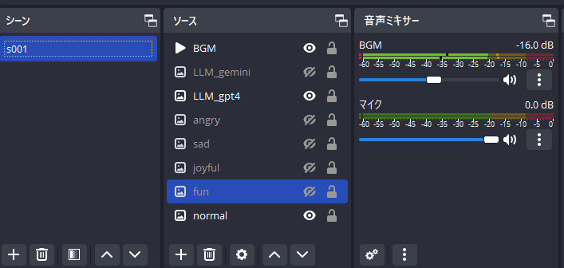

# README

これはAITuber「紅月れん」を動かすためのスクリプトです。

## OBSの起動

以下のシーン、ソースでセットする必要あり。



## VOICEVOXの起動

VOICEVOXのインストールディレクトリで以下のように実行

```
.\run.exe --use_gpu
```

## ai-tuberの起動

```
python .\main.py gpt4
```

## Test AI agent by REPL

AI部分のみのテストをしたいときは以下。

```
$ poetry shell
$ cd src
$ ptyhon

import os
import sys

os.environ["OPENAI_API_KEY"] = open(f"{os.environ['HOMEPATH']}\\.secret\\openai.txt", "r").read()
os.environ["GOOGLE_API_KEY"] = open(f"{os.environ['HOMEPATH']}\\.secret\\gemini.txt", "r").read()

from backend.chatai import ChatAI
ai = ChatAI("gpt4")

ai.say_chat({"speaker":"koduki", "message":"はじめまして"})
ai.say_chat({"speaker":"koduki", "message":"今日の東京都の天気は？"})
ai.say_short_talk()
```

## Special Thanks.

以下のコードやプロンプトを参考にさせて頂いています。

- [書籍: 「AITuberを作ってみたら生成AIプログラミングがよくわかった件」](https://books.rakuten.co.jp/rk/00ea8972a43a32da86144e5f4b340e7f/)
- [sr2mg/aituber_python_programing_example](https://github.com/sr2mg/aituber_python_programing_example)
- [ChatGPTでキャラを動かそう！キャラ再現率が高いプロンプトと回答をしっかり縛れるAPIフロー](https://zenn.dev/niwatoro/articles/180f6185c382bb)