# Ren Studio

Ren Studioは「AITuber 紅月れん」を動かすためのシステムです。GCP上でOBSを使い自動でニュース配信をするロジックが組まれています。

ニュースキャスターとしての**魂（Saint Graph）**、GCPでのOBS配信などの**肉体（Body）**、キャラクターの性格や立ち絵といった**精神（Mind）**の三層レイヤーで構築されています。例えばMindを置き換えるだけで、全体の構成を変えずに任意のキャラクターのAITuberを作成できます。また、Saint Graphの機能強化はMCPにより拡張が可能です。現在は、天気予報を取得するMCPが実装されています。

## 特徴

- **3層アーキテクチャ**: 魂・肉体・精神が分離された設計
- **プラグイン型キャラクター**: 新キャラクターの追加が容易
- **AIの自律判断とワークフローの併用**: MCPなどでAI自身に判断させるところと、システム的な固定の振る舞いであるワークフローの使い分け
- **OBSを含む自律配信の対応**: OAuth 認証、配信作成、リアルタイムコメント取得

## Quick Start

### 1. 動作モードの選択

本システムは環境変数 `STREAMING_MODE` で動作を切り替えられます。

- **録画モード** (`STREAMING_MODE=false`): OBS での録画のみ。
- **配信モード** (`STREAMING_MODE=true`): YouTube Live での配信とコメント取得。

YouTube 配信の具体的な設定方法は **[YouTube 配信セットアップ](docs/knowledge/youtube-setup.md)** を参照してください。

### 2. 環境変数の設定

`.env` ファイルを作成し、必要な情報を設定してください：

```bash
# 必須
GOOGLE_API_KEY="your_gemini_api_key"
STREAMING_MODE=false # false=録画, true=配信

# 配信設定 (STREAMING_MODE=true の場合のみ必須)
YOUTUBE_CLIENT_SECRET_JSON='{"installed":{...}}'
YOUTUBE_TOKEN_JSON='{"token":"...","refresh_token":"..."}'
STREAM_TITLE="本日のライブ配信"
```

### 3. 起動

```bash
# 本番配信・録画モード（Streamer）
docker compose up --build

# または開発モード（CLI）
docker compose up body-cli saint-graph
```

### 4. アクセス

- **OBS Studio**: http://localhost:8080/vnc.html (VNC)
- **Body API**: http://localhost:8002 (Streamer) / 8000 (CLI)
- **CLI 対話**: `docker attach app-body-cli-1`

## アーキテクチャ

### 三位一体構造

| コンポーネント | 役割 | 技術 |
|--------------|------|------|
| **Saint Graph（魂）** | 意思決定・対話 | Google Gemini ADK, MCP Client |
| **Body（肉体）** | 入出力・制御 | VoiceVox, OBS, YouTube API |
| **Mind（精神）** | キャラクター定義 | Markdown, JSON, アセット |

### マイクロサービス

| サービス | ポート | 説明 |
|---------|--------|------|
| `saint-graph` | - | 思考エンジン（魂） |
| `body-streamer` | 8002 | 本番配信用（肉体） |
| `body-cli` | 8000 | 開発用 CLI（肉体） |
| `tools-weather` | 8001 | 天気ツール（MCP） |
| `obs-studio` | 8080, 4455 | 映像合成 |
| `voicevox` | 50021 | 音声合成 |

詳細: [システム概要](docs/architecture/overview.md)

## 開発

### CLI モードでの対話

```bash
docker attach app-body-cli-1
# 入力: こんにちは
# 出力: [AI (joyful)]: 面を上げよ！わらわこそが紅月れんじゃ！
```

### テスト実行

```bash
# 全テスト
pytest

# ユニット/統合テストのみ
pytest tests/unit/
pytest tests/integration/
```

**テストカバレッジ**: 28テスト（ユニット: 11、統合: 15、E2E: 2）

主要テスト:
- `test_saint_graph.py` - AI応答パース・感情制御
- `test_speaker_id_integration.py` - VoiceVox speaker_id 伝播
- `test_youtube_oauth.py` - YouTube OAuth 認証
- `test_youtube_comment_adapter.py` - コメント取得

## キャラクター追加

```bash
data/mind/{character_name}/
├── mind.json          # 技術設定（speaker_id など）
├── persona.md         # 性格・口調
└── assets/            # 画像・音声
    ├── ai_neutral.png
    ├── ai_joyful.png
    └── ...
```

詳細: [キャラクター作成ガイド](docs/components/mind/character-creation-guide.md)

## 主な環境変数

### Saint Graph（魂）

| 変数 | デフォルト | 説明 |
|------|-----------|------|
| `GOOGLE_API_KEY` | (必須) | Gemini API キー |
| `STREAMING_MODE` | `false` | `true` で YouTube 配信, `false` で録画 |
| `RUN_MODE` | `cli` | `cli` または `streamer` |
| `BODY_URL` | (自動設定) | Body サービスの URL |
| `WEATHER_MCP_URL` | `http://tools-weather:8001/sse` | 天気 MCP サーバーの URL |
| `MODEL_NAME` | `gemini-2.5-flash-lite` | 使用モデル |
| `POLL_INTERVAL` | `1.0` | コメント取得の間隔（秒） |
| `STREAM_TITLE` | - | 配信タイトル |
| `STREAM_PRIVACY` | `private` | 配信公開設定 (`public`, `unlisted`, `private`) |
| `CHARACTER_NAME` | `ren` | キャラクター名 |
| `NEWS_DIR` | `/app/data/news` | ニュース原稿ディレクトリ |
| `STORAGE_TYPE` | `filesystem` | ストレージ種別 (`filesystem` / `gcs`) |
| `SECRET_PROVIDER_TYPE` | `env` | シークレット取得元 (`env` / `gcp`) |
| `ADK_TELEMETRY` | `false` | ADK テレメトリの有効化 |

### Body（肉体）

| 変数 | デフォルト | 説明 |
|------|-----------|------|
| `VOICEVOX_HOST` | `voicevox` | VoiceVox ホスト |
| `OBS_HOST` | `obs-studio` | OBS WebSocket ホスト |
| `YOUTUBE_CLIENT_SECRET_JSON` | - | OAuth 認証情報 |
| `YOUTUBE_TOKEN_JSON` | - | OAuth トークン |

詳細: [通信プロトコル](docs/architecture/communication.md)

## デプロイ

### ローカル開発

上記の Quick Start を参照してください。

### GCP 本番環境

クラウド上で自動運用するための完全な構成です：

**システム構成図**:

```mermaid
graph TD
    subgraph Trigger ["トリガー"]
        CS[Cloud Scheduler]
    end

    subgraph Orchestration ["制御レイヤー"]
        CW[Cloud Workflows]
    end

    subgraph News ["News Collector"]
        NC[News Collector Job]
        GCS_N[(GCS: ニュース原稿)]
        NC --> GCS_N
    end
    
    subgraph SaintGraph ["Saint Graph (魂)"]
        SG[Saint Graph Job]
        GCS_P[(GCS: プロンプト/記憶)]
        GCS_P --> SG
    end

    subgraph Tools ["拡張機能 (MCP)"]
        TW[Tools Weather Service]
    end

    subgraph Body ["Body (肉体 / GCE + GPU)"]
        STR[Body Streamer]
        VV[VoiceVox]
        OBS[OBS Studio]
        GCS_M[(GCS: 音声/アセット)]
        STR <--> GCS_M
        STR --> VV
        STR --> OBS
    end

    YT[YouTube Live]

    %% Flow
    CS -- "スケジュール実行" --> CW
    CW -- "パイプライン制御" --> News
    CW -- "パイプライン制御" --> SaintGraph
    CW -- "インスタンス起動/停止" --> Body

    %% Interactions
    SaintGraph -- "身体操作 (REST)" --> STR
    SaintGraph -- "自律ツール利用 (MCP)" --> Tools
    OBS -- "映像配信 (RTMP)" --> YT
```


**主な特徴**:
- ✅ **自動化**: Cloud Workflows による堅牢な配信パイプライン
  - 08:00: Cloud Scheduler がワークフローを起動
  - Step 1: ニュース収集ジョブを実行
  - Step 2: Body Node (GCE) を起動し、ヘルスチェックプロキシで **起動完了まで自動待機**（約5〜10分）
  - Step 3: Saint Graph (Cloud Run Job) を実行し配信開始
  - Step 4: 配信完了後、Body Node を自動停止
- ✅ **堅牢な監視**: 専用の Health Proxy により、VPC 内のサービス状態をセキュアに確認
- ✅ **コスト最適化**: Spot インスタンス使用で 60-90% コスト削減
- ✅ **スケール to Zero**: 使用していない時間は課金なし
- ✅ **Infrastructure as Code**: OpenTofu で完全に管理

**デプロイガイド**: **[opentofu/README.md](opentofu/README.md)**

## ドキュメント

| カテゴリ | ドキュメント |
|---------|-------------|
| **全体** | [ドキュメント一覧](docs/README.md) |
| **アーキテクチャ** | [システム概要](docs/architecture/overview.md), [通信プロトコル](docs/architecture/communication.md), [データフロー](docs/architecture/data-flow.md) |
| **Saint Graph（魂）** | [README](docs/components/saint-graph/README.md), [コアロジック](docs/components/saint-graph/core-logic.md), [プロンプト設計](docs/components/saint-graph/prompts.md) |
| **Body（肉体）** | [README](docs/components/body/README.md) |
| **Mind（精神）** | [VOICEVOX 辞書管理](docs/components/mind/voicevox-dictionary.md) |
| **運用・保守** | [トラブルシューティング](docs/knowledge/troubleshooting.md), [YouTube 配信セットアップ](docs/knowledge/youtube-setup.md) |
