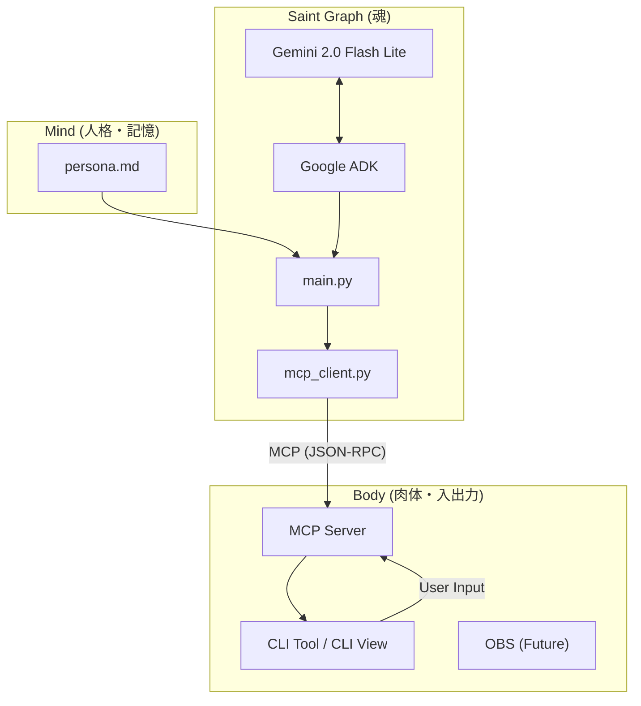

# AI Tuber システムアーキテクチャ

## 概要

本プロジェクトは、Google Agent Development Kit (ADK) と Model Context Protocol (MCP) を活用した、モジュール構成のAI Tuberシステムです。
「思考（Saint Graph）」、「身体（Body）」、「記憶・人格（Mind）」を明確に分離することで、拡張性と保守性を高めています。

## アーキテクチャ図

...（既存内容は保持）...

## 詳細解説: src/saint_graph/main.py の二重ループとチャンクストリーミングの振る舞い

以下は `src/saint_graph/main.py`（commit 9ce7adb3） の実装に基づく正確な解析と運用上の注記です。特に `main()` 内にある「外側（監督）ループ」と「内側（思考/行動）ループ」、および Gemini のストリーミング応答（チャンク）周りの処理を詳述します。

### 外側ループ（監督ループ）
- 役割: プロセス全体のライフサイクルを管理し、MCP クライアントの接続やリトライ、例外発生時の待機などを担います。
- 実装上の振る舞い:
  - `while True:` でプロセスを継続させ、`get_comments` のポーリングやソリロキュー（無入力時の自発的発話）を管理します。
  - ネットワーク等の一時的エラーが発生した場合は例外を捕捉して `await asyncio.sleep(5)` で待機後に再試行します。
  - 内側ループを抜ける（例: 致命的エラーや接続喪失）と、外側で再初期化やクリーンアップを試みる設計になっています。

### 内側ループ（思考→行動ループ、Soul cycle）
- 役割: 1サイクルごとに観測を受け、LLM に文脈を送り、生成された応答を処理（ツール呼び出し等）します。
- 実装のポイント:
  - 観測（`get_comments`）を元に `chat_history` を更新し、LLM に送る `LlmRequest` を構築します。
  - 内側で `while True:` を回すのは、LLM がツール呼び出し（function_call）を返し、その実行結果をフィードバックしてさらに追加のツール呼び出しやテキスト生成が必要かを継続的に処理するためです。
  - この内側ループは、LLM の応答が「ツール呼び出しを含む限り」継続し、ツール呼び出しが無くなった段階で break して内側ループを終了します。

### llm_request が二回代入されている理由（コード上の事実と判断）
- 元の実装では外側で一度 `llm_request` を作成した直後、内側ループ開始直前で再生成して上書きしていました。現状は二度目が有効で最初の代入は使われていないため冗長と判断しました。
- 推奨: テンプレートを残すなら `base_request` を用意して内側ループでコピーするか、不要なら最初の代入を削除すること。

### チャンクストリーミング（model.generate_content_async の扱い）
- 各チャンクの parts を逐次累積して最終的に統合する実装にする必要があります（最終チャンクだけに依存すると text や function_call を取りこぼす場合があるため）。
- 差分ログは「累積テキスト」に対して printed_len を比較して出力するのが安全です。
- function_call の args は文字列(JSON)かオブジェクトか両方の可能性があるため、呼び出し前に正規化（json.loads を試す等）し、ツール実行失敗時のエラーを履歴に含めて LLM にフィードバックする。

### 推奨修正点（まとめ）
1. `llm_request` の重複代入を解消し、テンプレートを明示する（`base_request` を導入）。
2. ストリーミングは累積バッファ（parts/text）を用いて最終 content を構築する。
3. `fc.args` の正規化とツール実行失敗時のエラーを `FunctionResponse` として履歴に追加する。
4. 単体/統合テストで複数チャンク・複数 function_call のシナリオを検証する。

（既存の詳細は本ファイルに保持しています）
