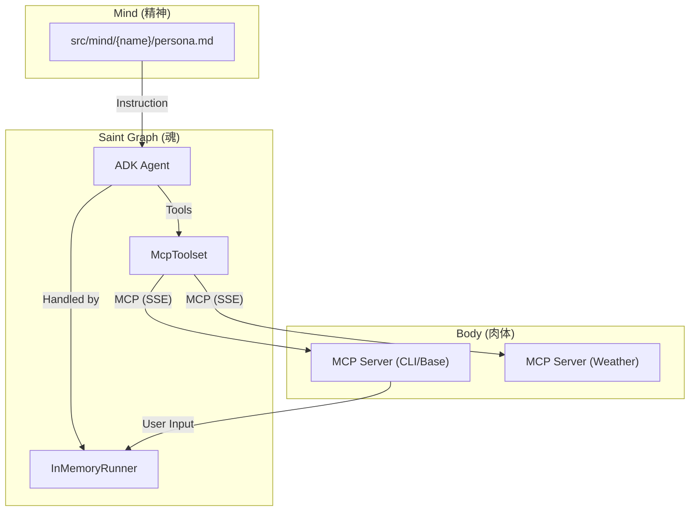

# AI Tuber システムアーキテクチャ

## 概要
本プロジェクトは、Google ADK (Agent Development Kit) と Model Context Protocol (MCP) を活用した、モジュール構成の AI Tuber システムです。
「Saint Graph (魂)」、「Mind (精神)」、「Body (肉体)」を明確に分離することで、拡張性と保守性を高めています。

## システムマップ



## モジュールリファレンス

各モジュールの詳細な仕様は、以下の仕様書で定義されています。

### 1. Saint Graph (魂)
*   **役割:** コアロジック。対話制御、意思決定、コンテキスト管理
*   **技術スタック:** Google ADK (`Agent`, `Runner`)
*   **仕様書:** [docs/specs/saint-graph.md](./specs/saint-graph.md)
*   **コード:** `src/saint_graph/`

### 2. Body (肉体)
*   **役割:** 外部入出力（コメント取得、発話、表情制御、天気取得等）
*   **インターフェース仕様:** [docs/specs/api-design.md](./specs/api-design.md) (MCP ツール定義)
*   **実装:** `src/body/`
*   **技術スタック:** MCP サーバー (FastMCP / SSE)

### 3. Mind (人格)
*   **役割:** キャラクター人格の定義
*   **定義:** `src/mind/{character_name}/persona.md`
*   **備考:** ADK Agent の System Instruction として注入されます。

### 4. 通信チャネル
*   **役割:** MCP サーバーとの通信管理
*   **仕様書:** [docs/specs/mcp-client.md](./specs/mcp-client.md)
*   **技術スタック:** Google ADK `McpToolset` (HTTP + SSE)

## ディレクトリ構造戦略

```text
.
├── docs/
│   ├── ARCHITECTURE.md  # このドキュメント
│   └── specs/           # 詳細仕様書（実装の真実のソース）
├── src/
│   ├── saint_graph/     # コアロジック (魂)
│   │   ├── main.py
│   │   ├── saint_graph.py
│   │   ├── prompt_loader.py # モジュール化されたプロンプト読み込み
│   │   └── news_service.py
│   ├── body/            # 周辺機器 (肉体)
│   │   ├── cli/
│   │   │   ├── main.py
│   │   │   ├── io_adapter.py # モジュール化された入出力
│   │   │   └── tools.py
│   │   └── weather/
│   └── mind/            # 人格データ (精神)
```
