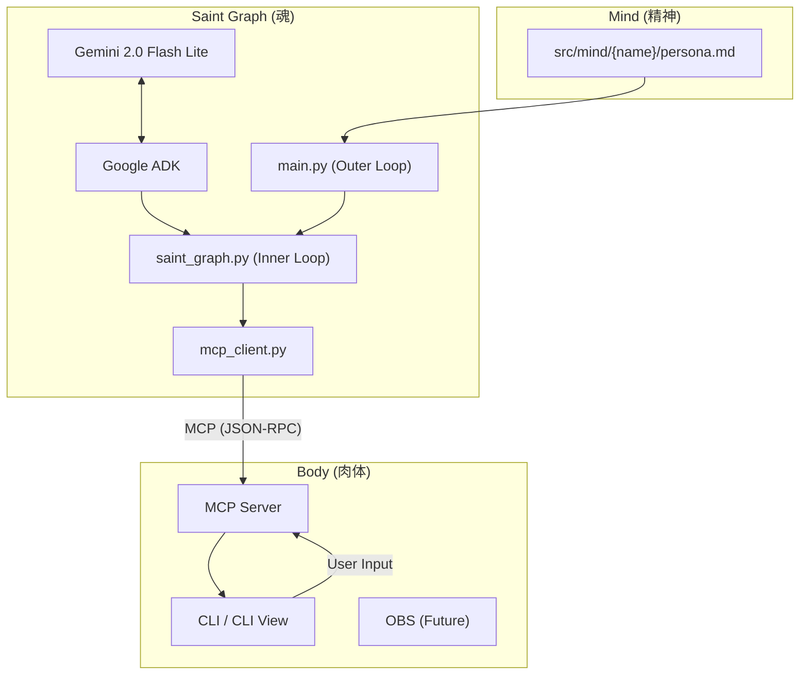

# AI Tuber システムアーキテクチャ

## 概要

本プロジェクトは、Google Agent Development Kit (ADK) と Model Context Protocol (MCP) を活用した、モジュール構成のAI Tuberシステムです。
「Saint Graph (魂)」、「Mind (精神)」、「Body (肉体)」を明確に分離することで、拡張性と保守性を高めています。

## アーキテクチャ図



## コンポーネント詳細

### 1. Saint Graph (魂)
- **パス**: `src/saint_graph/`
- **役割**: 思考、意思決定、行動の選択。
- **構成**:
    - `main.py`: **Outer Loop**。システム全体のライフサイクル管理、Bodyへの接続、コメント監視ループ（Chat Loop）を担当します。
    - `saint_graph.py`: **Inner Loop**。`SaintGraph` クラスを含み、LLMとの対話履歴管理、ストリーミング応答の処理、ツール実行ループを担当します。
    - `config.py`: 環境変数や定数の管理。
    - `mcp_client.py`: Body (MCP Server) と通信するためのクライアント。標準的な `list_tools`, `call_tool` インターフェースを提供します。
- **技術**: Google ADK, Gemini API (Gemini 2.5 Flash Lite), Python AsyncIO

### 2. Body (肉体)
- **パス**: `src/body/`
- **役割**: 外部世界とのインターフェース。音声出力、表情変更、コメント取得などの「能力」を提供します。
- **実装**: Model Context Protocol (MCP) サーバーとして実装されています。現在はCLIベースですが、将来的にはOBS連携やVTube Studio連携などの「異なる肉体」との連携を想定しています。
- **主要ファイル**:
    - `cli/main.py`: CLI版のBody実装。標準入力からのコメント受け取りや、標準出力への発話ログ表示を行います。

### 3. Mind (精神)
- **パス**: `src/mind/`
- **役割**: キャラクター性（人格・口調・行動指針など）の定義。
- **主要ファイル**:
    - `{name}/persona.md`: キャラクターごとの定義ファイル（例：`ren/persona.md`）。プロンプトエンジニアリングにより、LLMの振る舞いを制御します。
    - `src/saint_graph/main.py` 内の `load_persona(name)` 関数により、指定されたキャラクター名のディレクトリから厳密に読み込まれます。

## Google Agent Development Kit (ADK) について

Google ADK は、生成AIエージェントを構築するためのフレームワークです。
本プロジェクトでは、`src/saint_graph/` において以下の目的で使用しています。

1.  **モデル抽象化**:
    - `google.adk.models.Gemini` クラスを使用し、Gemini API への接続を簡潔に記述しています。
    - モデルの初期化や設定（Temperatureなど）を統一的に管理します。

2.  **ツール定義の標準化**:
    - `google.genai.types` を用いて、関数（ツール）の定義（名前、説明、引数スキーマ）を行います。
    - これにより、LLMに対して「何ができるか」を明確に伝え、Function Calling の精度を向上させています。

3.  **対話履歴の管理**:
    - エージェントのコンテキスト（過去のやり取り）を管理し、継続的な対話をサポートします。

従来の素のAPIコールに比べ、エージェント特有のループ（観測→思考→行動）の実装が容易になり、コードの可読性が向上しています。

## データフロー

1. **観測 (Observation)**:
    - Saint Graph (`main.py`) が `get_comments` ツールを定期的に呼び出します。
    - Body がユーザーからのコメント（標準入力など）を返します。

2. **思考 (Thinking)**:
    - Saint Graph (`saint_graph.py`) は観測結果と `persona.md` の内容を合わせて Gemini に送信します。
    - Gemini は状況に応じて、発話 (`speak`) や表情変更 (`change_emotion`) などのツール呼び出しを決定します。

3. **行動 (Action)**:
    - Saint Graph が決定されたツールを Body (MCP Server) に対して実行要求します。
    - Body が実際にアクション（ログ出力など）を行います。

## 技術スタック

- **LLM**: Gemini 2.5 Flash Lite
- **Agent Framework**: Google Agent Development Kit (ADK)
- **Protocol**: Model Context Protocol (MCP) - コンポーネント間の疎結合な通信を実現
- **Language**: Python 3.11
- **Container**: Docker / Docker Compose

## 詳細実装: Body (CLI)

`src/body/cli/main.py` は、MCPサーバーとして動作するCLIアプリケーションです。
主な実装ポイントを以下に解説します。

### 1. 入力処理 (Input Handling)

ユーザーからの入力（標準入力）をノンブロッキングで処理するため、別スレッドで読み込みを行い、Queueに格納しています。

```python
# input_queue に入力を溜める
input_queue = Queue()

def stdin_reader():
    """標準入力を読み込み、Queueに追加するスレッド"""
    while True:
        try:
            line = sys.stdin.readline()
            if line:
                input_queue.put(line.strip())
        except Exception:
            break

# デーモンスレッドとして起動
threading.Thread(target=stdin_reader, daemon=True).start()
```

### 2. ツール実装 (Tools Implementation)

LLMが実行する実際の関数です。CLI版では `print` 文で動作をシミュレートしています。

```python
async def speak(text: str, style: Optional[str] = None):
    """発話機能"""
    style_str = f" ({style})" if style else ""
    print(f"\n[AI{style_str}]: {text}")
    return "Speaking completed"

async def change_emotion(emotion: str):
    """表情変更"""
    print(f"\n[Expression]: {emotion}")
    return "Emotion changed"
```

### 3. MCP エンドポイント

FastAPI を使用して、MCP プロトコルに必要なエンドポイントを提供しています。

- **GET /sse**: Server-Sent Events (SSE) による接続確立。
- **POST /messages**: JSON-RPC によるリクエスト処理（ツール実行など）。

```python
@app.post("/messages")
async def handle_messages(request: Request):
    """JSON-RPC メッセージの処理"""
    data = await request.json()
    method = data.get("method")

    # ツール一覧の要求
    if method == "tools/list":
        return {
            "jsonrpc": "2.0",
            "result": { "tools": TOOL_DEFINITIONS },
            "id": data.get("id")
        }

    # ツールの実行
    if method == "tools/call":
        # ... (ツール名と引数を取得して実行) ...
```

## 詳細解説: Saint Graph の実装と振る舞い

`src/saint_graph/` 配下の実装に基づく解析です。特に `main.py` の「Outer Loop」と `saint_graph.py` の「Inner Loop」の役割分担、および Gemini のストリーミング処理について詳述します。

### キーコンセプト

*   **単一接続**: Saint Graph は単一の MCP エンドポイント (`MCP_URL` で定義) に接続します。
*   **標準化インターフェース**: `MCPClient` は、将来の移行を容易にするため、公式 Python SDK の `ClientSession` インターフェース (`list_tools`, `call_tool`) に合わせて設計されています。
*   **冪等性と信頼性**: ストリーミングレスポンスによる重複アクションの防止など、本番環境での信頼性を考慮した実装が含まれています。

### Outer Loop (ライフサイクル管理 & コメント監視)
- **ファイル**: `src/saint_graph/main.py`
- **役割**: プロセス全体の監督と、外部世界（ユーザーコメント）の監視。
- **振る舞い**:
  - `MCPClient` の接続確立と維持。
  - `SaintGraph` インスタンス（脳）の初期化。
  - **コメントポーリング**: 定期的（`POLL_INTERVAL`）に `get_comments` ツールを実行し、新しいコメントがあれば `SaintGraph` に渡して反応を開始させます。
  - ネットワークエラー等の例外を捕捉し、システムが停止しないようにリトライ制御を行います。

### Inner Loop (思考→行動ループ)
- **ファイル**: `src/saint_graph/saint_graph.py` (`SaintGraph` クラス)
- **役割**: 1回の対話ターンを完結させるための自律的な思考サイクル。
- **振る舞い**:
  - `process_turn(user_input)` が呼び出されると、ユーザー入力を履歴に追加し、Gemini へのリクエストを開始します。
  - このループは `while True:` で構成されており、Gemini が「ツール呼び出し（Function Calling）」を返し続ける限り、ループを継続します（例: 表情を変える -> 喋る -> 待機）。
  - Gemini が発話（通常のテキスト応答）を返した場合、あるいはツール呼び出しがない場合にループを終了します。

### チャンクストリーミング (Chunk Streaming) の詳細

Google ADK を介した Gemini との通信には `model.generate_content_async(stream=True)` を使用しています。この非同期ストリーミング処理において、以下の点に注意して実装されています。

1.  **リアルタイムログ出力**:
    - 中間のチャンク（`partial=True`）は、生成されているテキストの増分をリアルタイムにログ出力するために使用されます。これにより、ユーザーはAIが思考・発話している様子を即座に確認できます。

2.  **重複実行の防止 (冪等性)**:
    - 以前の実装では、全チャンクから `parts` を単純に累積していましたが、Gemini API の仕様上、複数のチャンクに同じ `FunctionCall` が断片的に、あるいは重複して含まれるケースがありました。
    - **現在の実装**: 中間チャンクでの蓄積は行わず、ストリーム完了時（`partial=False`）の **最終チャンク（Final Chunk）** に含まれる完全な `content` のみを使用しています。これにより、`speak` や `change_emotion` などのアクションが二重に実行されるバグを完全に防止しています。

3.  **Function Calling の扱い**:
    - 最終チャンクから取得した `final_content` の `parts` を検査します。
    - `function_call` が含まれている場合、引数（args）を正規化（JSONパース等）した上でツールを実行します。
    - 実行結果（またはエラー）は `FunctionResponse` として履歴に追加され、次回の Gemini への入力としてフィードバックされます。
