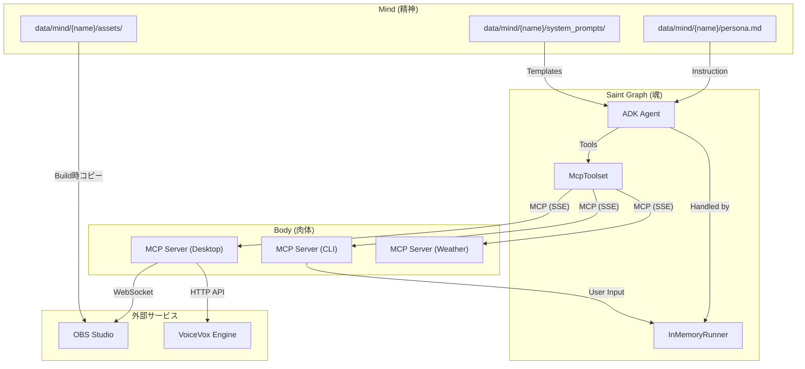

# AI Tuber システムアーキテクチャ

## 概要
本プロジェクトは、Google ADK (Agent Development Kit) と Model Context Protocol (MCP) を活用した、モジュール構成の AI Tuber システムです。
「Saint Graph (魂)」、「Mind (精神)」、「Body (肉体)」を明確に分離することで、拡張性と保守性を高めています。

## システムマップ



## モジュールリファレンス

各モジュールの詳細な仕様は、以下の仕様書で定義されています。

### 1. Saint Graph (魂)
*   **役割:** コアロジック。対話制御、意思決定、コンテキスト管理
*   **技術スタック:** Google ADK (`Agent`, `Runner`)
*   **仕様書:** [docs/specs/saint-graph.md](./specs/saint-graph.md)
*   **コード:** `src/saint_graph/`

### 2. Body (肉体)

#### 2.1 Body Desktop (本番用)
*   **役割:** ストリーミング制御ハブ。音声合成、OBS制御、YouTube連携
*   **技術スタック:** FastMCP, VoiceVox API, OBS WebSocket
*   **仕様書:** [docs/specs/body-desktop-architecture.md](./specs/body-desktop-architecture.md)
*   **コード:** `src/body/desktop/`
*   **ステータス:** ✅ 本番用

#### 2.2 Body CLI (開発用)
*   **役割:** CLI入出力（開発・テスト用）
*   **インターフェース仕様:** [docs/specs/api-design.md](./specs/api-design.md)
*   **コード:** `src/body/cli/`
*   **ステータス:** 🔧 開発・テスト用

#### 2.3 Body Weather
*   **役割:** 天気情報取得
*   **コード:** `src/body/weather/`
*   **ステータス:** ✅ 継続使用

### 3. Mind (人格)
*   **役割:** キャラクター人格の定義（プラグイン型）
*   **定義場所:** `data/mind/{character_name}/`
*   **構成:**
    *   `persona.md` - キャラクター設定
    *   `system_prompts/` - シーン別プロンプト
    *   `assets/` - OBS用アセット（立ち絵、BGM等）
*   **仕様書:** [docs/specs/character-package-specification.md](./specs/character-package-specification.md)
*   **備考:** ADK Agent の System Instruction として注入されます

### 4. OBS Studio (配信・映像)
*   **役割:** 映像合成、配信エンコード、VNC経由でGUI確認可能
*   **技術スタック:** OBS Studio, Xvfb, noVNC, WebSocket
*   **仕様書:** [docs/specs/obs-studio-configuration.md](./specs/obs-studio-configuration.md)
*   **コード:** `src/body/obs/`
*   **アクセス:** `http://localhost:8080/vnc.html`

### 5. VoiceVox Engine (音声合成)
*   **役割:** 音声データ生成APIの提供
*   **イメージ:** `voicevox/voicevox_engine:nvidia-ubuntu20.04-latest`
*   **エンドポイント:** `http://voicevox:50021`

### 6. 通信チャネル
*   **役割:** MCP サーバーとの通信管理
*   **仕様書:** [docs/specs/mcp-client.md](./specs/mcp-client.md)
*   **技術スタック:** Google ADK `McpToolset` (HTTP + SSE)

## ディレクトリ構造戦略

```text
.
├── docs/
│   ├── ARCHITECTURE.md       # このドキュメント
│   └── specs/                # 詳細仕様書
│       ├── body-desktop-architecture.md
│       ├── obs-studio-configuration.md
│       ├── character-package-specification.md
│       └── ...
├── data/
│   ├── news/                 # ニュース原稿
│   └── mind/                 # キャラクター定義（プラグイン型）
│       └── ren/              # キャラクター「れん」
│           ├── README.md
│           ├── persona.md
│           ├── system_prompts/
│           └── assets/
├── src/
│   ├── saint_graph/          # コアロジック (魂)
│   │   ├── main.py
│   │   ├── saint_graph.py
│   │   ├── prompt_loader.py  # data/mind から読み込み
│   │   └── news_service.py
│   └── body/                 # 周辺機器 (肉体)
│       ├── desktop/          # ストリーミング制御 (本番)
│       │   ├── main.py
│       │   ├── tools.py
│       │   ├── voice.py
│       │   ├── obs.py
│       │   └── youtube.py
│       ├── cli/              # CLI入出力 (開発)
│       ├── weather/          # 天気情報取得
│       └── obs/              # OBS Studio コンテナ
│           ├── Dockerfile
│           ├── supervisord.conf
│           ├── start_obs.sh
│           └── config/
└── tests/                    # テストスイート
```

## サービス構成（Docker Compose）

| サービス名 | 役割 | ポート | 依存関係 |
|-----------|------|--------|---------|
| `saint-graph` | 魂（思考エンジン） | - | body-desktop, body-weather |
| `body-desktop` | 肉体制御ハブ | 8002 | voicevox, obs-studio |
| `body-cli` | CLI入出力（開発用） | 8000 | - |
| `body-weather` | 天気情報 | 8001 | - |
| `obs-studio` | 配信・映像 | 8080, 4455 | - |
| `voicevox` | 音声合成 | 50021 | - |

## 通信フロー

1. **思考→発話**: saint-graph → MCP → body-desktop → VoiceVox API → /app/shared/audio → OBS (voiceソース)
2. **表情変更**: saint-graph → MCP → body-desktop → OBS WebSocket (ソース切り替え)
3. **コメント取得**: YouTube API ← body-desktop → MCP → saint-graph
4. **配信監視**: Browser → VNC (8080) → OBS GUI
