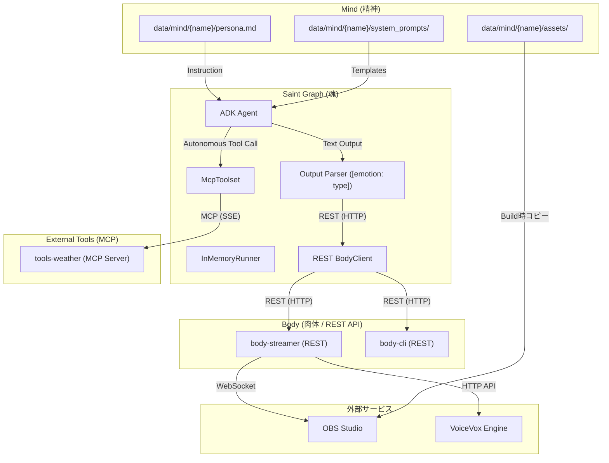

# AI Tuber システムアーキテクチャ

## 概要
本プロジェクトは、Google ADK (Agent Development Kit) と Model Context Protocol (MCP) を活用した、モジュール構成の AI Tuber システムです。
「Saint Graph (魂)」、「Mind (精神)」、「Body (肉体)」を明確に分離し、さらに通信プロトコルとして **REST API (身体操作)** と **MCP (外部ツール)** を使い分けるハイブリッド構成を採用しています。

## システムマップ



## モジュールリファレンス

### 1. Saint Graph (魂)
*   **役割:** コアロジック。対話制御、意志決定、コンテキスト管理。
*   **新機能:** AI のレスポンスから `[emotion: type]` タグをパースし、感情変更と発話を各身体サービスに振り分けます。
*   **技術スタック:** Google ADK (`Agent`, `Runner`), REST Client, MCP Client
*   **仕様書:** [docs/specs/saint-graph.md](./specs/saint-graph.md)
*   **コード:** `src/saint_graph/`

### 2. Body (肉体)
以前の MCP サーバー構成から、より確実で低レイテンシな **REST API** 構成へ移行しました。

#### 2.1 Body Streamer (本番用)
*   **役割:** ストリーミング制御ハブ。音声合成、OBS制御（表情・録画）、YouTube連携。
*   **技術スタック:** Starlette (REST API), VoiceVox API, OBS WebSocket
*   **仕様書:** [docs/specs/body-streamer-architecture.md](./specs/body-streamer-architecture.md)
*   **コード:** `src/body/streamer/`

#### 2.2 Body CLI (開発用)
*   **役割:** CLI入出力（開発・テスト用）。標準入力をコメントとして扱い、発話を標準出力に表示。
*   **技術スタック:** Starlette (REST API)
*   **コード:** `src/body/cli/`

### 3. External Tools (外部ツール)
AI が自力で解決できない情報（天気など）を取得するために使用します。

#### 3.1 Weather
*   **役割:** 天気情報取得。
*   **プロトコル:** MCP (Model Context Protocol)。AI が必要に応じて自律的に呼び出します。
*   **コード:** `src/tools/weather/`

### 4. Mind (人格)
*   **役割:** キャラクター人格の定義（プラグイン型）。
*   **構成:**
    *   `persona.md` - キャラクター設定。
    *   `system_prompts/` - シーン別プロンプト。
    *   `assets/` - OBS用アセット（立ち絵、BGM等）。
*   **仕様書:** [docs/specs/character-package-specification.md](./specs/character-package-specification.md)

### 5. OBS Studio (配信・映像)
*   **役割:** 映像合成、配信エンコード、VNC経由でGUI確認可能。
*   **技術スタック:** OBS Studio, Xvfb, noVNC, WebSocket
*   **仕様書:** [docs/specs/obs-studio-configuration.md](./specs/obs-studio-configuration.md)
*   **アクセス:** `http://localhost:8080/vnc.html`

### 6. VoiceVox Engine (音声合成)
*   **役割:** 音声データ生成APIの提供。
*   **エンドポイント:** `http://voicevox:50021`

---

## 通信フロー (Hybrid)

1.  **AI の思考と出力**: `saint-graph` が Gemini からレスポンスを受け取る。
2.  **感情・発話の抽出**: `Parser` が `[emotion: happy] 挨拶なのじゃ！` から感情 (`happy`) と本文を分離。
3.  **身体操作 (REST)**: `saint-graph` → HTTP/JSON → `body-streamer` → VoiceVox/OBS。
4.  **情報取得 (MCP)**: AI が天気を知りたい場合、`saint-graph` → MCP → `tools-weather`。
5.  **配信監視**: ブラウザ → VNC (8080) → OBS GUI。

---

## テスト

本システムは**28個のテスト** (ユニット: 11、統合: 15、E2E: 2スキップ) でカバーされています。

### テスト構成

```
tests/
├── unit/              # ユニットテスト (11)
│   ├── test_prompt_loader.py      # mind.json読み込み (5)
│   ├── test_saint_graph.py        # AI応答パース・感情制御 (3)
│   ├── test_obs_recording.py      # OBS録画制御 (3)
│   └── test_weather_tools.py      # 天気ツール (3)
├── integration/       # 統合テスト (15)
│   ├── test_speaker_id_integration.py  # speaker_id伝播検証 (4)
│   ├── test_rest_body_cli.py           # Body CLI API (5)
│   ├── test_newscaster_logic_v2.py     # ニュース配信フロー (2)
│   ├── test_newscaster_flow.py         # ニュース読み上げ (1)
│   ├── test_mind_prompts.py            # プロンプト読み込み (1)
│   └── test_agent_scenarios.py         # 天気+発話シナリオ (1)
└── e2e/               # E2Eテスト (2スキップ)
    └── test_system_smoke.py        # システム全体動作確認
```

### テスト実行

```bash
# 全テスト実行
pytest

# カテゴリ別
pytest tests/unit/
pytest tests/integration/
```

詳細は [README.md](../README.md#テストの実行) を参照してください。
