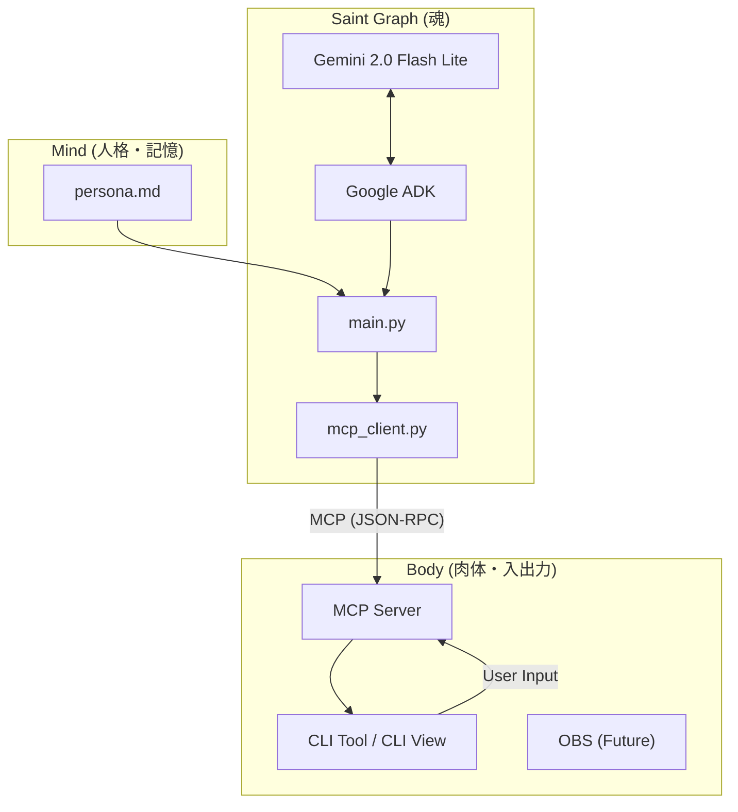

# AI Tuber システムアーキテクチャ

## 概要

本プロジェクトは、Google Agent Development Kit (ADK) と Model Context Protocol (MCP) を活用した、モジュール構成のAI Tuberシステムです。
「思考（Saint Graph）」、「身体（Body）」、「記憶・人格（Mind）」を明確に分離することで、拡張性と保守性を高めています。

## アーキテクチャ図



## コンポーネント詳細

### 1. Saint Graph (魂)
- **パス**: `src/saint_graph/`
- **役割**: 思考、意思決定、行動の選択。
- **主要ファイル**:
    - `main.py`: メインの思考ループ。`get_comments` で状況を観測し、LLMにコンテキストを与え、適切なツール（`speak`, `change_emotion` 等）を実行します。
    - `mcp_client.py`: Body (MCP Server) と通信するためのクライアント。
- **技術**: Google ADK, Gemini API (Gemini 2.0 Flash Lite), Python AsyncIO

### 2. Body (肉体)
- **パス**: `src/body/`
- **役割**: 外部世界とのインターフェース。音声出力、表情変更、コメント取得などの「能力」を提供します。
- **実装**: Model Context Protocol (MCP) サーバーとして実装されています。現在はCLIベースですが、将来的にはOBS連携やVTube Studio連携などの「異なる肉体」との連携を想定しています。
- **主要ファイル**:
    - `cli_tool/main.py`: CLI版のBody実装。標準入力からのコメント受け取りや、標準出力への発話ログ表示を行います。

### 3. Mind (人格)
- **パス**: `src/mind/`
- **役割**: キャラクターの性格、口調、行動指針の定義。
- **主要ファイル**:
    - `ren/persona.md`: 「紅月れん」というキャラクターの定義ファイル。プロンプトエンジニアリングにより、LLMの振る舞いを制御します。

## Google Agent Development Kit (ADK) について

Google ADK は、生成AIエージェントを構築するためのフレームワークです。
本プロジェクトでは、`src/saint_graph/` において以下の目的で使用しています。

1.  **モデル抽象化**:
    - `google.adk.models.Gemini` クラスを使用し、Gemini API への接続を簡潔に記述しています。
    - モデルの初期化や設定（Temperatureなど）を統一的に管理します。

2.  **ツール定義の標準化**:
    - `google.genai.types` を用いて、関数（ツール）の定義（名前、説明、引数スキーマ）を行います。
    - これにより、LLMに対して「何ができるか」を明確に伝え、Function Calling の精度を向上させています。

3.  **対話履歴の管理**:
    - エージェントのコンテキスト（過去のやり取り）を管理し、継続的な対話をサポートします。

従来の素のAPIコールに比べ、エージェント特有のループ（観測→思考→行動）の実装が容易になり、コードの可読性が向上しています。

## データフロー

1. **観測 (Observation)**:
    - Saint Graph が `get_comments` ツールを呼び出します。
    - Body がユーザーからのコメント（標準入力など）を返します。

2. **思考 (Thinking)**:
    - Saint Graph は観測結果と `persona.md` の内容を合わせて Gemini に送信します。
    - Gemini は状況に応じて、発話 (`speak`) や表情変更 (`change_emotion`) などのツール呼び出しを決定します。

3. **行動 (Action)**:
    - Saint Graph が決定されたツールを Body (MCP Server) に対して実行要求します。
    - Body が実際にアクション（ログ出力など）を行います。

## 技術スタック

- **LLM**: Gemini 2.0 Flash Lite
- **Agent Framework**: Google Agent Development Kit (ADK)
- **Protocol**: Model Context Protocol (MCP) - コンポーネント間の疎結合な通信を実現
- **Language**: Python 3.11
- **Container**: Docker / Docker Compose

## 詳細実装: Body (CLI Tool)

`src/body/cli_tool/main.py` は、MCPサーバーとして動作するCLIアプリケーションです。
主な実装ポイントを以下に解説します。

### 1. 入力処理 (Input Handling)

ユーザーからの入力（標準入力）をノンブロッキングで処理するため、別スレッドで読み込みを行い、Queueに格納しています。

```python
# input_queue に入力を溜める
input_queue = Queue()

def stdin_reader():
    """標準入力を読み込み、Queueに追加するスレッド"""
    while True:
        try:
            line = sys.stdin.readline()
            if line:
                input_queue.put(line.strip())
        except Exception:
            break

# デーモンスレッドとして起動
threading.Thread(target=stdin_reader, daemon=True).start()
```

### 2. ツール実装 (Tools Implementation)

LLMが実行する実際の関数です。CLI版では `print` 文で動作をシミュレートしています。

```python
async def speak(text: str, style: Optional[str] = None):
    """発話機能"""
    style_str = f" ({style})" if style else ""
    print(f"\n[AI{style_str}]: {text}")
    return "Speaking completed"

async def change_emotion(emotion: str):
    """表情変更"""
    print(f"\n[Expression]: {emotion}")
    return "Emotion changed"
```

### 3. MCP エンドポイント

FastAPI を使用して、MCP プロトコルに必要なエンドポイントを提供しています。

- **GET /sse**: Server-Sent Events (SSE) による接続確立。
- **POST /messages**: JSON-RPC によるリクエスト処理（ツール実行など）。

```python
@app.post("/messages")
async def handle_messages(request: Request):
    """JSON-RPC メッセージの処理"""
    data = await request.json()
    method = data.get("method")

    # ツール一覧の要求
    if method == "tools/list":
        return {
            "jsonrpc": "2.0",
            "result": { "tools": TOOL_DEFINITIONS },
            "id": data.get("id")
        }

    # ツールの実行
    if method == "tools/call":
        # ... (ツール名と引数を取得して実行) ...
```

## 詳細解説: src/saint_graph/main.py の二重ループとチャンクストリーミングの振る舞い

以下は `src/saint_graph/main.py`（commit 9ce7adb3） の実装に基づく正確な解析と運用上の注記です。特に `main()` 内にある「外側（監督）ループ」と「内側（思考/行動）ループ」、および Gemini のストリーミング応答（チャンク）周りの処理を詳述します。

### 外側ループ（監督ループ）
- 役割: プロセス全体のライフサイクルを管理し、MCP クライアントの接続やリトライ、例外発生時の待機などを担います。
- 実装上の振る舞い:
  - `while True:` でプロセスを継続させ、`get_comments` のポーリングやソリロキュー（無入力時の自発的発話）を管理します。
  - ネットワーク等の一時的エラーが発生した場合は例外を捕捉して `await asyncio.sleep(5)` で待機後に再試行します。
  - 内側ループを抜ける（例: 致命的エラーや接続喪失）と、外側で再初期化やクリーンアップを試みる設計になっています。

### 内側ループ（思考→行動ループ、Soul cycle）
- 役割: 1サイクルごとに観測を受け、LLM に文脈を送り、生成された応答を処理（ツール呼び出し等）します。
- 実装のポイント:
  - 観測（`get_comments`）を元に `chat_history` を更新し、LLM に送る `LlmRequest` を構築します。
  - 内側で `while True:` を回すのは、LLM がツール呼び出し（function_call）を返し、その実行結果をフィードバックしてさらに追加のツール呼び出しやテキスト生成が必要かを継続的に処理するためです。
  - この内側ループは、LLM の応答が「ツール呼び出しを含む限り」継続し、ツール呼び出しが無くなった段階で break して内側ループを終了します。

### llm_request が二回代入されている理由（コード上の事実と判断）
- コード行 135-143 で `llm_request` を一旦作成していますが、その直後（内側ループ開始）で行 147-155 にて同一内容で再度 `llm_request` を作成しています。
- 事実: 1回目の代入は内側ループの2回目の代入によって即座に上書きされ、1回目のインスタンス自体は実際の LLM 呼び出しには使用されていません。
- 判断: 現状のコードでは「冗長」であり、意図的に保持する理由は見当たりません。恐らくリファクタリング途中の残骸、あるいは将来的に base_request を用いて inner loop でコピーして更新することを想定していた名残と推測されます。
- 推奨修正:
  - 意図的にテンプレートを保持したい場合は `base_request`（または `base_llm_request`）のように別名で保持し、内側ループでコピーして更新する。
  - 単に不要なら外側での最初の代入を削除して、内側でのみ生成するようにする。

例（改善案）:
```python
base_request = LlmRequest(...)
while True:
    # 必要に応じて base_request をコピーして入力を追加
    req = copy.deepcopy(base_request)
    req.contents = chat_history
    async for chunk in model.generate_content_async(req, stream=True):
        ...
```

### チャンクストリーミング（model.generate_content_async の扱い）
- 実装の流れ（現コード）:
  1. `async for chunk in model.generate_content_async(llm_request, stream=True):` でストリームを受け取る。
  2. 各 chunk の `chunk.content.parts` の `text` を結合して `full_text` として扱い、`printed_len` を使って差分をログ出力しようとしている。
  3. `if not chunk.partial: final_response = chunk` により、非部分チャンク（ストリームの終端）を最終応答として保持する。
  4. ループ終了後、`final_response.content` を `chat_history` に追加し、function_call があればその処理へ進む。

- 技術的な問題点（現コードに見られる潜在的バグ）:
  1. ログ差分の算出が不正確
     - `full_text` は各チャンクごとにそのチャンク内のテキストのみを結合したものであり、これを `printed_len`（チャンクを跨いで保持）と比較しているため、累積文字列に対する差分計算として機能していません。
     - 結果として一度ログ出力して以降は新しいチャンクのテキストが小さければログされなくなる可能性があります。
     - 対策: ストリーム全体の蓄積用変数（例: `accum_text`）を用意し、新しいチャンクのテキストを append してから `accum_text[printed_len:]` をログする。

  2. `final_response` の扱い
     - `final_response = chunk` としているため、最終チャンクの `chunk.content` のみが保存されます。API のチャンク構造によっては最終チャンクに全てのテキストや function_call 情報が含まれない可能性があります（プロバイダ実装に依存）。
     - 対策: チャンクが持つ `content.parts` を逐次的に統合し、ストリームの最後に統合済みの `Content` オブジェクトを作成して履歴に追加する方が堅牢です。

- 改善案（擬似コード）:
```python
accum_parts = []
accum_text = ""
async for chunk in model.generate_content_async(req, stream=True):
    if chunk.content and chunk.content.parts:
        for p in chunk.content.parts:
            # テキストは累積
            if getattr(p, 'text', None):
                accum_text += p.text
            accum_parts.append(p)
    # 差分ログ
    if len(accum_text) > printed_len:
        logger.info(f"Gemini: {accum_text[printed_len:]}")
        printed_len = len(accum_text)
    if not chunk.partial:
        # ストリーム完了
        final_content = types.Content(role="assistant", parts=accum_parts)
        break

# final_content を chat_history に追加する
chat_history.append(final_content)
```

### ツール呼び出し（function_call）のループ処理
- 現状の設計では、`final_response.content.parts` 内の `function_call` を検出し、順に `client.call_tool(fc.name, fc.args)` を呼び出して実行結果を `types.FunctionResponse` としてパートに包み、`chat_history` に `role='user'` の形で追加しています。
- これにより、LLM はツール実行結果を次の入力文脈として受け取り、必要なら追加の function_call を返して連鎖的に処理できます（ツールチェーンの実現）。
- 注意点:
  - `fc.args` のフォーマット（文字列か JSON か）に依存するため、`client.call_tool` 側で受け取り可能な形に正規化する必要があります。
  - ツール実行で失敗した場合は、ツール実行結果としてエラー情報を含めること。現状はログにエラーを出すのみで履歴に失敗情報を入れていないため、LLM に状況を伝えられない可能性があります。

### 実運用上の推奨事項（まとめ）
1. `llm_request` の重複代入を解消する: 意図的にテンプレートを保持する場合は別名で保持し、内側ループではコピーを作る。
2. ストリーミングは累積バッファを用いて正確に差分ログと最終コンテンツを構築する。
3. `fc.args` の正規化と、ツール実行失敗時の結果（エラー）を `chat_history` に含めてフィードバックする。
4. ロギングを充実させ、外側ループは高レベルイベント、内側ループは LLM サイクル単位の詳細ログを残す。

---

以上を `docs/ARCHITECTURE.md` に追記しました。実運用上の修正案も併記しているので、コード側の修正（リファクタリング）を行う場合は私の代わりに PR を作成できます。
