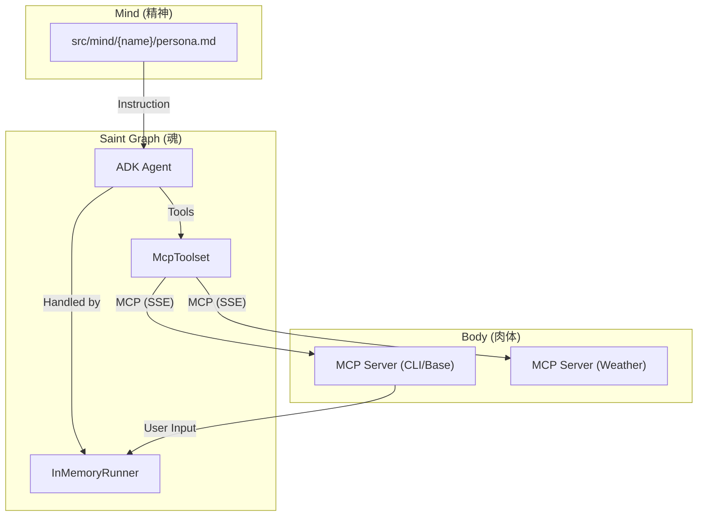

# AI Tuber System Architecture

## 概要
本プロジェクトは、Google ADK (Agent Development Kit) と Model Context Protocol (MCP) を活用した、モジュール構成のAI Tuberシステムです。
「Saint Graph (魂)」、「Mind (精神)」、「Body (肉体)」を明確に分離することで、拡張性と保守性を高めています。

## System Map



## Module Reference

各モジュールの詳細な仕様は以下のスペックファイルで定義されています。

### 1. Saint Graph (Brain/Soul)
*   **Role:** 対話制御、意思決定、コンテキスト管理
*   **Tech:** Google ADK (`Agent`, `Runner`)
*   **Spec:** [docs/specs/saint-graph.md](./specs/saint-graph.md)
*   **Code:** `src/saint_graph/`

### 2. Body (Interaction Layer)
*   **Role:** 外部入出力（コメント取得、発話、表情制御、天気取得等）
*   **Interface Spec:** [docs/specs/api-design.md](./specs/api-design.md) (MCP Tools Definition)
*   **Implementation:** `src/body/`
*   **Tech:** MCP Server (FastMCP / SSE)

### 3. Mind (Personality)
*   **Role:** キャラクター人格の定義
*   **Definition:** `src/mind/{character_name}/persona.md`
*   **Note:** ADK Agent の System Instruction として注入されます。

### 4. Communication Channel
*   **Role:** MCP サーバーとの通信管理
*   **Spec:** [docs/specs/mcp-client.md](./specs/mcp-client.md)
*   **Tech:** Google ADK `McpToolset` (HTTP + SSE)

## Directory Structure Strategy

```text
.
├── docs/
│   ├── ARCHITECTURE.md  # This Map
│   └── specs/           # Detailed Specifications (Source of Truth for implementation)
├── src/
│   ├── saint_graph/     # Core Logic (The Brain)
│   ├── body/            # Peripherals (The Body)
│   └── mind/            # Personality Data (The Mind)
```
