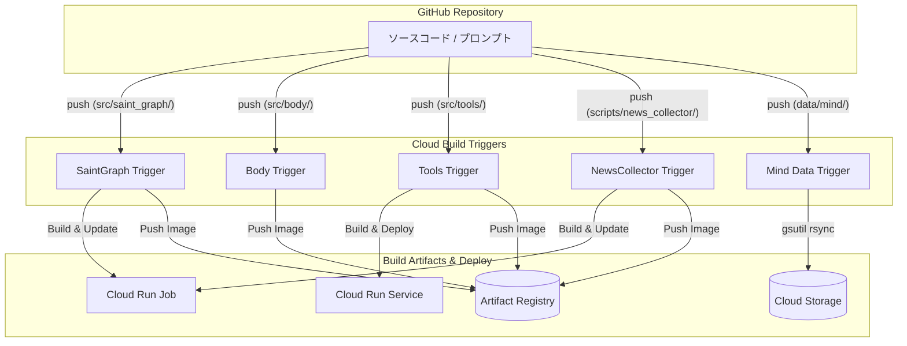

# CI/CD アーキテクチャ (Cloud Build)

本システムは、Google Cloud Build を使用してビルド、デプロイ、およびデータ同期の自動化を実現しています。ディレクトリベースのトリガー構成により、変更があったコンポーネントのみを効率的に更新します。

---

## 自動化の全体像



---

## トリガー構成

特定のディレクトリ配下のファイルが変更された場合のみ、対応するトリガーが起動します。すべてのトリガーは `src/infra/` の変更にも反応するように設定されています。

| トリガー名 | 監視パス (includedFiles) | 実行内容 |
| :--- | :--- | :--- |
| **saint-graph** | `src/saint_graph/**`, `src/infra/**` | イメージビルド ＆ Cloud Run Job 更新 |
| **body** | `src/body/**`, `src/infra/**` | イメージビルド ＆ Artifact Registry への Push |
| **tools-weather** | `src/tools/weather/**`, `src/infra/**` | イメージビルド ＆ Cloud Run Service 更新 |
| **news-collector** | `scripts/news_collector/**`, `src/infra/**` | イメージビルド ＆ Cloud Run Job 更新 |
| **mind-data-sync** | `data/mind/**` | `gsutil rsync` による GCS への高速同期 |

---

## 役割分担（OpenTofu vs Cloud Build）

本システムでは、「インフラの器」と「アプリケーションの中身」を明確に分離して管理しています。

### OpenTofu (IaC)
- **役割**: インフラの静的な構成定義（リソースの作成、権限設定、ネットワーク構築）。
- **デプロイ対象**:
    - Cloud Run Job/Service の作成（初期設定）
    - IAM ロールの割り当て
    - Cloud Build トリガー自体の作成
    - GCE (`startup.sh` を含む) の構成

### Cloud Build (CI/CD)
- **役割**: アプリケーションの動的な更新（ビルド、イメージ更新、データ同期）。
- **デプロイ対象**:
    - コンテナイメージのビルドと Push
    - Cloud Run のイメージ更新 (`gcloud run ... update --image`)
    - GCS へのプロンプトデータの同期

---

## セキュリティと権限

Cloud Build は、最小権限の原則に基づき、以下の IAM ロールを使用してデプロイを実行します：

- `roles/run.admin`: Cloud Run のイメージ更新用
- `roles/iam.serviceAccountUser`: 実行用サービスアカウントの紐付け用
- `roles/storage.objectAdmin`: GCS へのデータ同期用
- `roles/artifactregistry.writer`: イメージの Push 用

---

## 手動実行の手順 (`gcloud`)

Git Push を行わずに、または特定のトリガーを強制的に実行したい場合は、以下の `gcloud` コマンドを使用してください。

### 1. トリガーを起動する
GitHub に接続済みのトリガーを、特定のブランチを指定して手動で起動します。

```bash
# Saint Graph のビルド & デプロイ
gcloud beta builds triggers run ai-tuber-saint-graph --branch=main --region=global

# Mind データの同期
gcloud beta builds triggers run ai-tuber-mind-data-sync --branch=main --region=global
```

### 2. ローカルから直接ビルドをリクエストする
Git への Push を介さず、ローカルのファイル一式を GCP に送信してビルドを実行します（YAML のテスト等に便利）。

```bash
# Saint Graph のオンデマンドビルド
gcloud builds submit --config cloudbuild-saint-graph.yaml \
  --substitutions=_REGION=asia-northeast1,_REPOSITORY=ai-tuber .
```

---

## トラブルシューティング

### Secret not found (404)

**症状:**
```
Failed to access secret 'GOOGLE_API_KEY': 404 Secret [projects/.../secrets/GOOGLE_API_KEY] not found
```

**原因:** GCP Secret Manager の ID は `google-api-key`（kebab-case）だが、アプリが `GOOGLE_API_KEY`（UPPER_CASE）で要求していた。

**解決:** `GcpSecretProvider.get_secret()` にシークレット名の自動正規化を追加（`GOOGLE_API_KEY` → `google-api-key`）。

---

### GCS object not found (persona.md)

**症状:**
```
No such object: bucket/data/mind/ren/persona.md
```

**原因:** `cloudbuild-mind.yaml` の同期コマンドが `gsutil rsync data/mind/ gs://bucket/mind/` のため、GCS 上のキーは `mind/ren/persona.md`。アプリが `data/mind/ren/persona.md` でアクセスしていた。

**解決:** `PromptLoader` で `STORAGE_TYPE` に応じてパスを分岐：
- GCS: `mind/{character_name}/`
- Local: `data/mind/{character_name}/`

---

### Missing key inputs argument (ADK)

**症状:**
```
ValueError: Missing key inputs argument! To use the Google AI API, provide (`api_key`) arguments.
```

**原因:** Google ADK の `Gemini` クラスは `os.environ["GOOGLE_API_KEY"]` を直接参照する。`SecretProvider` 経由で取得したキーはアプリ変数にのみ格納され、環境変数に反映されていなかった。

**解決:** `config.py` で SecretProvider から取得した API キーを `os.environ["GOOGLE_API_KEY"]` にセットするようにした。

---

### デプロイ後に修正が反映されない

**症状:** コード修正をコミットしたが、Cloud Run Job の実行結果が変わらない。

**原因:** `git push` していない。Cloud Build のトリガーは GitHub のブランチからコードを取得するため、ローカルのコミットだけでは反映されない。

**解決:**
```bash
git push
gcloud beta builds triggers run <trigger-name> --branch=<branch> --region=global
```

---

## 関連ファイル
- `cloudbuild-*.yaml`: 各コンポーネントのビルド定義
- `opentofu/cloudbuild.tf`: トリガーと IAM の定義
