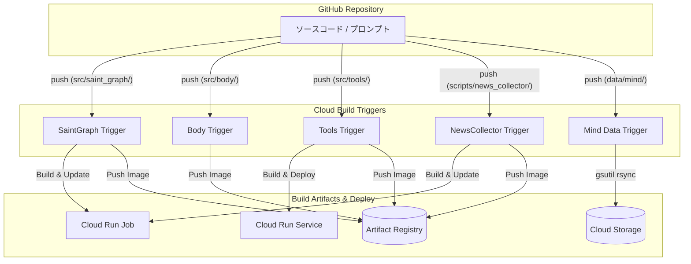

# CI/CD アーキテクチャ (Cloud Build)

本システムは、Google Cloud Build を使用してビルド、デプロイ、およびデータ同期の自動化を実現しています。ディレクトリベースのトリガー構成により、変更があったコンポーネントのみを効率的に更新します。

---

## 自動化の全体像

---

## トリガー構成

特定のディレクトリ配下のファイルが変更された場合のみ、対応するトリガーが起動します。すべてのトリガーは `src/infra/` の変更にも反応するように設定されています。

| トリガー名 | 監視パス (includedFiles) | 実行内容 |
| :--- | :--- | :--- |
| **saint-graph** | `src/saint_graph/**`, `src/infra/**` | イメージビルド ＆ Cloud Run Job 更新 |
| **body** | `src/body/**`, `src/infra/**` | イメージビルド ＆ Artifact Registry への Push |
| **tools-weather** | `src/tools/weather/**`, `src/infra/**` | イメージビルド ＆ Cloud Run Service 更新 |
| **news-collector** | `scripts/news_collector/**`, `src/infra/**` | イメージビルド ＆ Cloud Run Job 更新 |
| **mind-data-sync** | `data/mind/**` | `gsutil rsync` による GCS への高速同期 |

---

## 役割分担（OpenTofu vs Cloud Build）

本システムでは、「インフラの器」と「アプリケーションの中身」を明確に分離して管理しています。

### OpenTofu (IaC)
- **役割**: インフラの静的な構成定義（リソースの作成、権限設定、ネットワーク構築）。
- **デプロイ対象**:
    - Cloud Run Job/Service の作成（初期設定）
    - IAM ロールの割り当て
    - Cloud Build トリガー自体の作成
    - GCE (`startup.sh` を含む) の構成

### Cloud Build (CI/CD)
- **役割**: アプリケーションの動的な更新（ビルド、イメージ更新、データ同期）。
- **デプロイ対象**:
    - コンテナイメージのビルドと Push
    - Cloud Run のイメージ更新 (`gcloud run ... update --image`)
    - GCS へのプロンプトデータの同期

---

## セキュリティと権限

Cloud Build は、最小権限の原則に基づき、以下の IAM ロールを使用してデプロイを実行します：

- `roles/run.admin`: Cloud Run のイメージ更新用
- `roles/iam.serviceAccountUser`: 実行用サービスアカウントの紐付け用
- `roles/storage.objectAdmin`: GCS へのデータ同期用
- `roles/artifactregistry.writer`: イメージの Push 用

---

## 関連ファイル
- `cloudbuild-*.yaml`: 各コンポーネントのビルド定義
- `opentofu/cloudbuild.tf`: トリガーと IAM の定義
