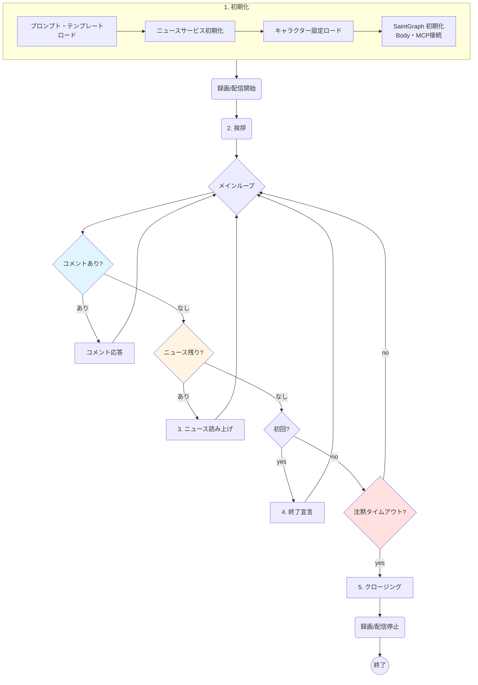

# データフロー

AI Tuber システムにおけるデータの流れと処理シーケンスを説明します。

---



---

## ターン処理シーケンス

Saint Graph の `process_turn()` メソッドは以下の手順で処理を行います。

### 1. AI にユーザー入力を送信

```python
# ニュース原稿または視聴者コメントを入力
user_input = "次のニュースを読み上げてください: ..."
```

### 2. AI がストリーミングレスポンスを生成

```python
# Gemini が感情タグ付きテキストを生成
response = """
[emotion: neutral] さて、まずは全国の天気予報じゃ。
[emotion: joyful] 今日は全国的に高気圧に覆われて、良いお天気になりそうじゃのう！
"""
```

### 3. センテンス分割

生成されたテキスト全体を文単位（`。！？.!?`）で分割します。

```python
sentences = [
    "[emotion: neutral] さて、まずは全国の天気予報じゃ。",
    "[emotion: joyful] 今日は全国的に高気圧に覆われて、良いお天気になりそうじゃのう！"
]
```

### 4. 各センテンスの処理（順次実行）

各センテンスについて以下を順次実行します:

#### 4-1. 感情タグのパース

```python
# "[emotion: joyful]" を抽出
emotion = "joyful"
text = "今日は全国的に高気圧に覆われて、良いお天気になりそうじゃのう！"
```

#### 4-2. 感情変更（必要な場合）

```python
if emotion != previous_emotion:
    await body_client.change_emotion(emotion)
```

#### 4-3. 音声生成と再生

```python
await body_client.speak(text, style=emotion)
# センテンス単位で再生完了まで待機
```

### 5. 全センテンスの再生完了

すべてのセンテンスの再生が完了してから、次のターンへ進みます。

---

## センテンス順次再生フロー

音声の重複や途切れを防ぐため、センテンス単位で順次再生を行います。

### 処理シーケンス

```
センテンス1: "さて、まずは全国の天気予報じゃ。" (3.7秒)
  ①-VoiceVox-→ 音声生成（WAV 生成）
  ②-ファイル書込→ /app/shared/voice/speech_0001.wav
  ③-WAV 解析--→ 再生時間計算: 3.7秒
  ④-OBS 制御-→ メディアソース更新
  ⑤-再生待機--→ 3.9秒待機（duration + 0.2秒）
  ⑥-完了-----→ 次のセンテンスへ

センテンス2: "今日は全国的に..." (6.2秒)
  ①-VoiceVox-→ 音声生成
  ②-ファイル書込→ /app/shared/voice/speech_0002.wav
  ③-WAV 解析--→ 再生時間計算: 6.2秒
  ④-OBS 制御-→ メディアソース更新
  ⑤-再生待機--→ 6.4秒待機
  ⑥-完了-----→ 完了
```

### 詳細ステップ（Body Streamer）

1. **音声生成**: VoiceVox API (`/audio_query`, `/synthesis`) で WAV バイナリ取得
2. **永続化**: `/app/shared/voice/speech_{id}.wav` として保存
3. **長さ計算**: WAV ヘッダーから再生時間（秒）を計算
4. **OBS 通知**: `SetInputSettings` でメディアソースを新ファイルに更新
5. **状態確保**: `SetInputMute(False)` および `SetInputVolume(1.0)` を送信
6. **同期待機**: 設定が反映されるまで 0.1秒待機
7. **再生開始**: `TriggerMediaInputAction(RESTART)` を送信
8. **完了待機**: `asyncio.sleep(duration + 0.2)` で再生完了を待つ
9. **次のセンテンス**: 前の音声が完了してから次を処理

---

## コメント取得フロー

### ポーリングループ

```python
while True:
    # 1.0秒ごとにコメントをポーリング
    comments = await body_client.get_comments()
    
    if comments:
        # 新しいコメントがあれば AI に渡す
        response = await agent.process_turn(comments)
    
    await asyncio.sleep(1.0)
```

### YouTube Live コメント取得（Streamer モード）

```
1. 配信作成
   └─→ YouTube Live API: broadcasts.insert()

2. ライブチャットID取得（リトライロジック）
   ├─→ videos.list(id=video_id)
   ├─→ activeLiveChatId が無い場合: 10秒待機して再試行
   └─→ 最大10回リトライ

3. サブプロセス起動
   └─→ fetch_comments.py を別プロセスで実行
       ├─ OAuth 認証
       ├─ liveChatMessages.list() でコメント取得
       └─ JSON 形式で標準出力に書き出し

4. コメントパース
   ├─→ サブプロセスの stdout を非同期で読み取り
   ├─→ JSON パース
   └─→ キューに追加

5. エラー監視
   └─→ サブプロセスの stderr を監視してログ出力
```

---

## 音声ファイル管理フロー

### 共有ボリューム

- **ボリューム名**: `voice_share`
- **マウントポイント**: `/app/shared/voice`
- **書き込み**: `body-streamer`
- **読み込み**: `obs-studio`

### クリーンアップ

```python
# body-streamer 起動時
for file in glob("/app/shared/voice/speech_*.wav"):
    if file != "speech_0000.wav":  # デフォルトファイルは保持
        os.remove(file)
```

---

## エラーハンドリングフロー

### OBS WebSocket 接続リトライ

```python
retries = 5
delay = 2.0

for i in range(retries):
    try:
        ws_client.connect()
        break
    except Exception:
        await asyncio.sleep(delay)
        delay *= 2  # 指数バックオフ
```

### YouTube Live Chat ID 取得リトライ

```python
max_attempts = 10
retry_interval = 10  # 秒

for attempt in range(max_attempts):
    response = youtube.videos().list(id=video_id).execute()
    chat_id = response['items'][0]['liveStreamingDetails'].get('activeLiveChatId')
    
    if chat_id:
        break
    
    await asyncio.sleep(retry_interval)
```

---

## 関連ドキュメント

- [システム概要](./overview.md) - 全体アーキテクチャ
- [Saint Graph - Core Logic](../components/saint-graph/core-logic.md) - ターン処理の実装
- [Body - Audio Playback](../components/body/streamer/audio-playback.md) - 音声再生システム
- [Body - YouTube](../components/body/streamer/youtube.md) - YouTube コメント取得
