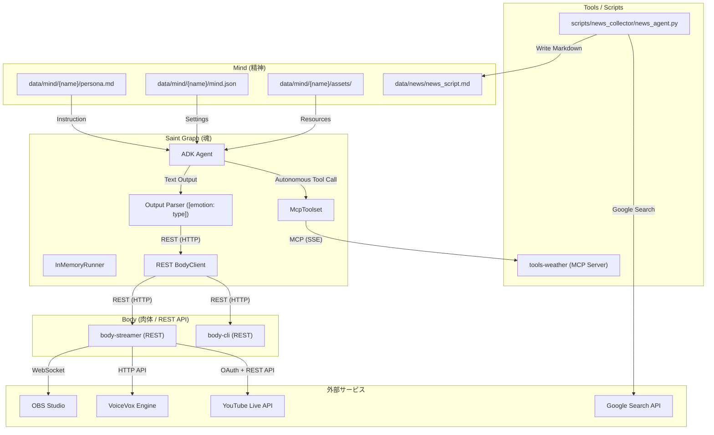

# システム概要

AI Tuber は、**魂（Saint Graph）**、**肉体（Body）**、**精神（Mind）** の三位一体で構成される AITuber システムです。

## 三位一体アーキテクチャ

### Saint Graph（魂）
Google ADK をベースにした意思決定エンジン。システムの思考と対話を担当します。

**責任範囲**:
- AI による意思決定とターン処理
- ニュース原稿の管理と配信フロー制御
- Body への指令送信（REST Client）
- 外部ツールの活用（MCP Client）
- 感情パース処理

### Body（肉体）
ストリーミング制御ハブ。物理的な入出力と外部サービスとの連携を担当します。

**責任範囲**:
- 音声合成（VoiceVox）
- 映像制御（OBS Studio）
- YouTube Live 配信・コメント取得
- REST API サーバーの提供

**モード**:
- **Streamer モード**: 本番配信用（OBS + VoiceVox + YouTube）
- **CLI モード**: 開発・デバッグ用（標準入出力）

### Mind（精神）
キャラクター定義パッケージ。個性とペルソナを担当します。

**責任範囲**:
- キャラクターのペルソナ定義
- 技術設定（speaker_id など）
- アセット（画像・音声）の管理

---

## システム構成

### マイクロサービス構成

| サービス | 役割 | ポート | 通信方式 |
|---------|------|--------|---------|
| `saint-graph` | 思考・対話エンジン（魂） | - | REST Client / MCP Client |
| `body-streamer` | ストリーミング制御ハブ（肉体） | 8002 | REST API Server |
| `body-cli` | 開発用 CLI 入出力（肉体） | 8000 | REST API Server |
| `tools-weather` | 天気情報取得ツール（環境） | 8001 | MCP Server (SSE) |
| `obs-studio` | 配信・映像合成 | 8080, 4455 | VNC / WebSocket |
| `voicevox` | 音声合成エンジン | 50021 | HTTP API |

### システムマップ



---

## デプロイ環境

本システムは、異なる環境に応じて最適化された構成でデプロイできます。

### ローカル開発環境 (Docker Compose)

すべてのコンポーネントを単一のホスト上で実行します。

- **構成**: `docker-compose.yml` を使用
- **用途**: 開発、テスト、デバッグ
- **特徴**: すべてのサービスが同じネットワーク上で通信

### GCP 本番環境 (ハイブリッド構成)

マイクロサービスを役割に応じて最適なGCPサービスに配置します。

| サービス | GCP サービス | 理由 |
|---------|-------------|------|
| **Saint Graph** | **Cloud Run Job** | バッチ処理（配信）、最大24時間タイムアウト |
| Tools Weather | Cloud Run Service | ステートレス、MCP Server |
| News Collector | Cloud Run Job | 毎朝のバッチ処理（ニュース収集） |
| Body (OBS + VoiceVox + Streamer) | **Compute Engine + GPU** | GPU共有、高速ファイルアクセス |

**主な特徴**:
- ✅ **自動化**: Cloud Scheduler による毎朝の自動実行
  - 07:00: ニュース収集
  - 07:55: GCE 起動（OBS & VoiceVox 準備）
  - 08:00: **配信開始**（Saint Graph Job 実行）
  - 08:40: GCE 停止（配信終了）
- ✅ **コスト最適化**: Spot インスタンス使用で 60-90% コスト削減
- ✅ **スケール to Zero**: Cloud Run は未使用時に課金なし
- ✅ **共有ストレージ**: Cloud Storage でニュース原稿を共有
- ✅ **Secret Manager 統合**: API キーや YouTube 認証情報を安全に管理
- ✅ **Git 不要**: Artifact Registry から直接イメージをプル

**Saint Graph を Job として実装した理由**:
- HTTP サーバーの実装が不要（コードがシンプル）
- タイムアウトが最大 24 時間（Cloud Run Service は 60 分まで）
- バッチ処理（配信）としての実態に即している
- ヘルスチェック不要で堅牢

詳細: **[GCP デプロイガイド](../../opentofu/README.md)**

---

## ハイブリッド REST/MCP アーキテクチャ

システムは役割に応じて通信プロトコルを使い分けます。

### REST API（Body 操作用）

**用途**: 確実に実行しなければならない「身体操作」

- 発話（speak）
- 表情変更（change_emotion）
- コメント取得（get_comments）
- 録画・配信制御（recording/streaming）

**特徴**:
- 同期的な実行保証
- エラーハンドリングが容易
- 低レイテンシ

### MCP（外部ツール用）

**用途**: AI が自律的に判断して使う「情報取得ツール」

- 天気予報（get_weather）
- 将来的に追加される知識検索など

**特徴**:
- 動的なツール発見
- AI が必要に応じて呼び出し
- スキーマ駆動

---

## コンポーネント間の依存関係

```
Saint Graph (魂)
  ├─ depends on → Body (REST API)
  ├─ depends on → Tools (MCP)
  └─ uses → Mind (ファイル読み込み)

Body (肉体)
  ├─ controls → OBS Studio
  ├─ controls → VoiceVox
  ├─ integrates → YouTube Live
  └─ serves → REST API

Mind (精神)
  └─ provides → Character definitions
```

**疎結合の原則**:
- Saint Graph は Body の実装詳細を知らない（REST API のみ）
- Body は複数のモード（CLI/Streamer）を持てる
- Mind はプラグイン型で交換可能

---

## 配信フロー

1. **初期化**: Saint Graph が Body と MCP Tools に接続
2. **挨拶**: キャラクターが自己紹介
3. **ニュース配信ループ**:
   - ニュース原稿を読み上げ
   - AI が感情を付与してテキスト生成
   - センテンス単位で音声合成・再生
   - コメントを取得して質疑応答
4. **終了**: クロージング挨拶

詳細は [data-flow.md](./data-flow.md) を参照してください。

---

---

## テスト

本システムは、ユニットテスト、統合テスト、および E2E テストによってカバーされています。

### テスト構成

```
tests/
├── unit/              # ユニットテスト
│   ├── test_prompt_loader.py      # mind.json 読み込み
│   ├── test_saint_graph.py        # AI 応答パース・感情制御
│   ├── test_obs_recording.py      # OBS 録画制御
│   ├── test_weather_tools.py      # 天気ツール
│   └── test_news_collector.py     # ニュース収集エージェント
├── integration/       # 統合テスト
│   ├── test_speaker_id_integration.py  # speaker_id 伝播検証
│   ├── test_rest_body_cli.py           # Body CLI API
│   ├── test_newscaster_logic_v2.py     # ニュース配信フロー
│   ├── test_newscaster_flow.py         # ニュース読み上げ
│   ├── test_mind_prompts.py            # プロンプト読み込み
│   ├── test_youtube_oauth.py           # YouTube OAuth 認証
│   ├── test_youtube_comment_adapter.py  # YouTube コメント取得
│   └── test_agent_scenarios.py         # 天気+発話シナリオ
└── e2e/               # E2E テスト
    └── test_system_smoke.py        # システム全体動作確認
```

### テスト実行

```bash
# 全テスト実行
pytest

# カテゴリ別
pytest tests/unit/
pytest tests/integration/
```

詳細は [README.md](../../README.md#テストの実行) を参照してください。

---

## 関連ドキュメント

- [通信プロトコル](./communication.md) - REST/MCP 仕様
- [データフロー](./data-flow.md) - 処理シーケンス
- [Saint Graph](../components/saint-graph/README.md) - 魂の詳細
- [Body](../components/body/README.md) - 肉体の詳細
- [Mind](../components/mind/README.md) - 精神の詳細
