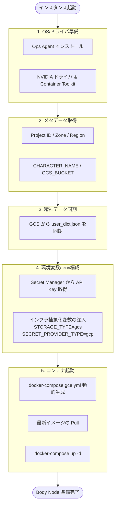

# GCE プロビジョニング (startup.sh)

GCE インスタンスの起動時に実行される `startup.sh` は、ステートレスな「肉体（Body Node）」を動的に構築する役割を担います。

---

## 処理フロー

---

## 詳細な振る舞い

### 1. インフラの準備（OS層）
- **Ops Agent**: Cloud Logging と連携し、Docker コンテナのログ（`/var/lib/docker/containers/*/*.log`）を収集します。
- **NVIDIA GPU 構成**: GCE 上で GPU 最適化された音声合成（VoiceVox）と映像合成（OBS Studio）を実行するために、ドライバと NVIDIA Runtime をセットアップします。

### 2. メタデータによる動作定義
- インスタンスに設定されたメタデータ（カスタム属性）を取得し、動的に挙動を変更します。
- `CHARACTER_NAME`: どのキャラクターとして振る舞うかを決定。
- `gcs_bucket`: 同期元となる Google Cloud Storage バケット。
- `stream_title` / `stream_description`: 配信情報のオーバーライド。

### 3. ステートレスなデータ同期（Mind データ）
- **依存の最小化**: コンテナイメージ内には特定のキャラクターデータ（辞書ファイル等）を保持しません。
- **Just-in-Time 同期**: 起動直後に GCS から `gs://{bucket}/mind/{character}/user_dict.json` を取得し、ホストマウント経由で VoiceVox コンテナに渡します。

### 4. シークレットと抽象化レイヤーの構成
- **安全なシークレット取得**: API キーや OAuth トークンをイメージに含めず、Secret Manager から直接取得します。
- **抽象化変数の注入**:
    - `STORAGE_TYPE=gcs`: アプリケーションにクラウドストレージの使用を指示。
    - `SECRET_PROVIDER_TYPE=gcp`: アプリケーションに Secret Manager の使用を指示。
- これにより、アプリケーションは自身の環境（ローカルかクラウドか）を意識することなく、最適なバックエンドを選択できます。

### 5. コンテナオーケストレーション
- **動的 YAML 生成**: Registry パス（Region 依存）やホストパスを含んだ `docker-compose.gce.yml` をその場で生成します。
- **Fail-Fast**: いずれかのステップ（ドライバインストール、シークレット取得、コンテナ起動）が失敗した場合、エンジンスクリプトは即座に終了し、異常を通知します。

---

## 関連ファイル
- `scripts/gce/startup.sh`: プロビジョニングスクリプト本体
- `docker-compose.yml`: ローカル開発用構成（比較用）
- [システム概要](../../architecture/overview.md): 全体アーキテクチャ
- [インフラ抽象化レイヤー](../../README.md#インフラ抽象化): 抽象化の設計思想
