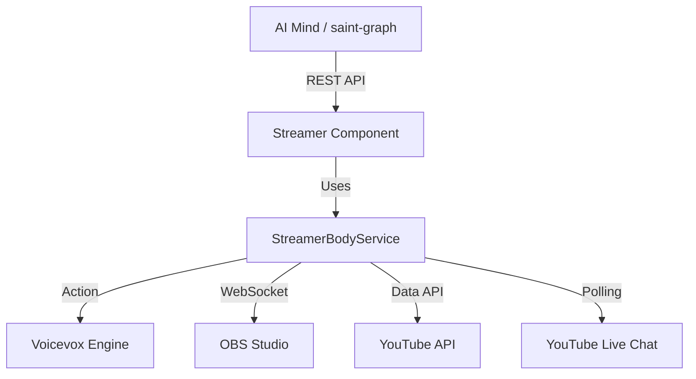

# Streamer コンポーネント (Streamer モード)

**Streamer** コンポーネントは、AI Tuber の「肉体（Body）」として機能する REST API サーバーです。音声合成 (TTS)、表情制御 (OBS ソース制御)、配信状態管理、および YouTube との連携を統括します。

## 概要

Streamer コンポーネントは、AI の「思考（Mind）」と視覚的・聴覚的な表現との間を仲介する役割を果たします。[`BodyServiceBase`](../../../src/body/service.py) インターフェースに準拠した抽象化されたアーキテクチャで実装されています。

## アーキテクチャ

Standard Streamer モードの構成図：

## API リファレンス

### ヘルスチェック
- **`GET /health`**: サーバーの稼働状態を返します。

### 音声と表情
- **`POST /api/speak`**: 発話の生成と再生をキューに追加します（非ブロッキング）。
    - 実装: `StreamerBodyService.speak()`
    - Body: `{"text": "こんにちは", "style": "neutral", "speaker_id": 1}`
- **`POST /api/change_emotion`**: アバターの表情変更をキューに追加します（非ブロッキング）。
    - 実装: `StreamerBodyService.change_emotion()`
    - Body: `{"emotion": "happy"}`

### インタラクション
- **`GET /api/comments`**: 内部キューから新規コメントを取得します。
    - 実装: `StreamerBodyService.get_comments()`

### 配信制御
- **`POST /api/broadcast/start`**: `STREAMING_MODE` に基づき、配信または録画を開始します。
    - 実装: `StreamerBodyService.start_broadcast()`
- **`POST /api/broadcast/stop`**: 現在の配信または録画を停止します。内部的にキューの消化（発話完了）を待機します。
    - 実装: `StreamerBodyService.stop_broadcast()`

### キュー制御
- **`POST /api/queue/wait`**: キュー内のすべての処理が完了するまで待機します。
    - 実装: `StreamerBodyService.wait_for_queue()`

## 環境変数

| 変数名 | 説明 | デフォルト値 |
|----------|-------------|---------|
| `PORT` | サーバーの待機ポート | `8000` |
| `VOICEVOX_HOST` | Voicevox エンジンのホスト名 | `voicevox` |
| `VOICEVOX_PORT` | Voicevox エンジンのポート | `50021` |
| `OBS_HOST` | OBS Studio のホスト名 | `obs-studio` |
| `OBS_PORT` | OBS WebSocket のポート | `4455` |
| `OBS_PASSWORD` | OBS WebSocket のパスワード | (なし) |
| `YOUTUBE_API_KEY` | YouTube Data API v3 キー | (なし) |
| `YOUTUBE_LIVE_CHAT_ID` | コメント取得用のライブチャット ID | (なし) |
| `YOUTUBE_POLLING_INTERVAL`| コメント取得の間隔（秒） | `5` |
| `STREAMING_MODE` | `true` の場合、YouTube Live 連携を有効化 | `false` |

## セットアップと開発

Streamer コンポーネントは、生成された WAV ファイルを OBS に渡して再生するために、`/app/shared/voice` の共有ボリュームを使用します。
