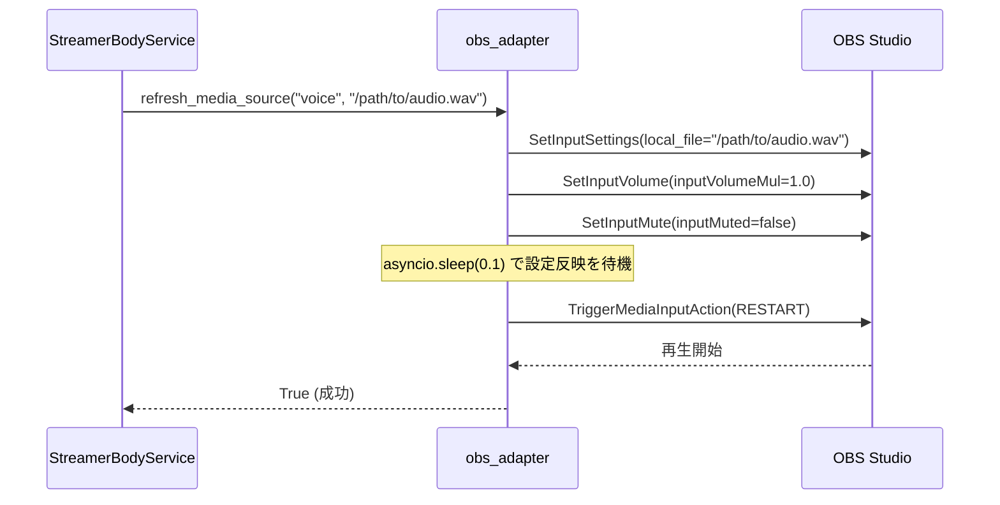
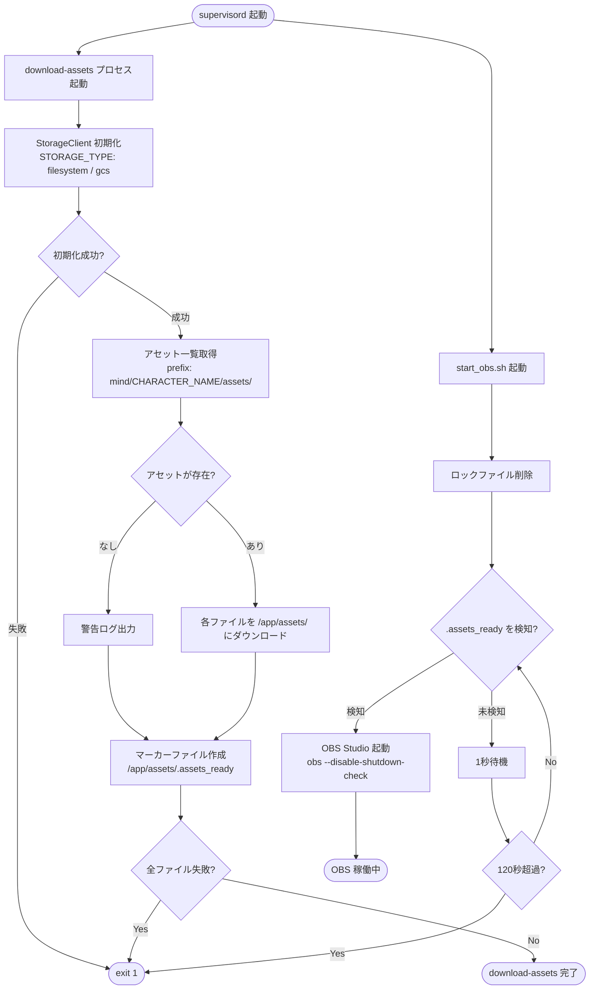

# OBS コンポーネント

OBS コンポーネントは、AI Tuber の映像・音声出力を担う中核です。  
`obs_adapter.py` が Python 側から OBS を制御し、`obs-studio` コンテナがヘッドレス環境で OBS Studio を稼働させます。

---

## 1. アダプター (`obs_adapter.py`)

`obs_adapter.py` は OBS WebSocket (v5) を通じて、配信画面の制御・立ち絵の変更・音声再生を行うモジュールです。

### 主な役割

| 役割 | 説明 |
| :--- | :--- |
| **表情（立ち絵）の変更** | 指定された感情に合わせて、OBS 上のソースの表示・非表示を切り替えます |
| **音声再生のトリガー** | `voice_adapter.py` で生成されたファイルのパスを OBS のメディアソースにセットし、再生を開始します |
| **配信・録画制御** | YouTube から取得したストリームキーの設定や、配信の開始・停止を制御します |

---

### OBS WebSocket 連携の詳細

#### 使用ライブラリ

```
obs-websocket-py  (pip install obs-websocket-py)
```

`obswebsocket` パッケージを使用します。インポートに失敗した場合（ライブラリ未インストール）は `None` にフォールバックし、OBS 機能なしで起動できるよう設計されています。

```python
try:
    from obswebsocket import obsws, requests as obs_requests
except ImportError:
    obs_requests = None
    obsws = None
```

#### OBS WebSocket v5 の特徴

本システムは **OBS WebSocket v5 プロトコル**（OBS Studio 28 以降に標準搭載）を使用します。v4 との主な違いは以下の通りです：

| 項目 | v4 (旧) | v5 (現行) |
| :--- | :--- | :--- |
| ソース操作 | `SetSceneItemProperties` | `SetSceneItemEnabled` + `GetSceneItemList` でID取得が必要 |
| メディア再生 | `RestartMedia` | `TriggerMediaInputAction` + `OBS_WEBSOCKET_MEDIA_INPUT_ACTION_RESTART` |
| 入力設定 | `SetSourceSettings` | `SetInputSettings` |
| 音量設定 | `SetVolume` | `SetInputVolume` |
| ミュート設定 | `SetMute` | `SetInputMute` |
| 配信設定 | `SetStreamSettings` | `SetStreamServiceSettings` |

> **互換性**: `refresh_media_source` 内では v5 API が失敗した場合に v4 の `RestartMedia` にフォールバックする処理が含まれています。

#### 使用している OBS WebSocket リクエスト一覧

| リクエスト | 用途 |
| :--- | :--- |
| `GetVersion` | 接続確認（ヘルスチェック代わり） |
| `GetCurrentProgramScene` | 現在のアクティブシーン名を取得 |
| `GetSceneItemList` | シーン内のソース一覧と `sceneItemId` を取得 |
| `SetSceneItemEnabled` | ソースの表示・非表示を切り替え |
| `SetInputSettings` | メディアソースの `local_file` パスを更新 |
| `SetInputVolume` | 音量を 1.0（最大）にリセット |
| `SetInputMute` | ミュートを解除 |
| `TriggerMediaInputAction` | メディアを先頭から再生（`RESTART`） |
| `StartRecord` / `StopRecord` | 録画の開始・停止 |
| `GetRecordStatus` | 録画中かどうかの確認 |
| `SetStreamServiceSettings` | YouTube RTMP のストリームキーを設定 |
| `StartStream` / `StopStream` | 配信の開始・停止 |
| `GetStreamStatus` | 配信中かどうかの確認 |

---

### 接続管理

グローバル変数 `ws_client` にシングルトンとして接続を保持します。各関数の冒頭で `connect()` を呼び出し、以下のロジックで接続状態を保証します：

```
connect() 呼び出し
  ├─ ws_client が None でない場合
  │    └─ GetVersion() で疎通確認
  │         ├─ 成功 → そのまま使用
  │         └─ 失敗 → disconnect() してから再接続へ
  └─ ws_client が None の場合
       └─ obsws(host, port, password).connect() で新規接続
```

接続失敗時は `False` を返し、呼び出し元は処理をスキップします（例外を上位に伝播させない設計）。

---

### 音声再生の内部フロー

`refresh_media_source()` は単純なファイル差し替えではなく、OBS の再生タイミングを確実に制御するために複数のステップを踏みます：



> **なぜ sleep が必要か**: `SetInputSettings` の直後に `RESTART` を送ると、OBS が古いファイルを再生してしまうケースがあるため、0.1 秒の待機を挟んでいます。

---

### 感情とソースのマッピング

`EMOTION_MAP` によって、API で指定された感情を OBS 内のソース名に変換します。複数の感情値が同じソースにマッピングされる場合があります。

| API 感情値 | OBS ソース名 | 備考 |
| :--- | :--- | :--- |
| `neutral` | `normal` | デフォルト（未知の感情のフォールバック先） |
| `happy` | `joyful` | |
| `joyful` | `joyful` | `happy` のエイリアス |
| `fun` | `fun` | |
| `sad` | `sad` | |
| `sorrow` | `sad` | `sad` のエイリアス |
| `angry` | `angry` | |

> **注意**: OBS のシーンコレクション内で、これらの名前のソース（画像やグループ）が定義されている必要があります。未知の感情値は `neutral` → `normal` にフォールバックします。

---

### 公開関数一覧

| 関数 | 引数 | 戻り値 | 説明 |
| :--- | :--- | :--- | :--- |
| `connect()` | なし | `bool` | OBS に接続（再接続含む） |
| `disconnect()` | なし | なし | OBS から切断 |
| `set_source_visibility(source, visible, scene)` | `str, bool, str?` | `bool` | 任意のソースの表示・非表示を切り替え |
| `set_visible_source(emotion)` | `str` | `str` | 感情に対応するソースを表示し、他を非表示 |
| `refresh_media_source(source, file_path)` | `str, str` | `bool` | メディアソースのファイルを差し替えて再生 |
| `start_recording()` | なし | `bool` | 録画開始 |
| `stop_recording()` | なし | `bool` | 録画停止 |
| `get_record_status()` | なし | `bool` | 録画中かどうかを確認 |
| `start_streaming(stream_key)` | `str` | `bool` | YouTube RTMP 配信開始 |
| `stop_streaming()` | なし | `bool` | 配信停止 |
| `get_streaming_status()` | なし | `bool` | 配信中かどうかを確認 |

### 環境変数

| 変数名 | 説明 | デフォルト値 |
| :--- | :--- | :--- |
| `OBS_HOST` | OBS Studio のホスト名 | `obs-studio` |
| `OBS_PORT` | OBS WebSocket のポート | `4455` |
| `OBS_PASSWORD` | WebSocket のパスワード | (なし) |

---

## 2. コンテナ構成 (`src/body/streamer/obs/`)

ヘッドレス環境（GPU 搭載の GCE インスタンス等）で OBS Studio を動作させるための専用 Docker コンテナです。

### ファイル構成

```
src/body/streamer/obs/
├── Dockerfile            # コンテナイメージ定義
├── supervisord.conf      # プロセスマネージャ設定
├── start_obs.sh          # OBS 起動スクリプト
├── download_assets.py    # アセットダウンロードスクリプト
├── apps                  # Fluxbox アプリ設定
└── config/               # OBS 設定ファイル群
    ├── global.ini
    ├── fluxbox/init
    └── basic/
        ├── profiles/Untitled/basic.ini
        └── scenes/Untitled.json
```

### `Dockerfile`

`nvidia/cuda:11.8.0-runtime-ubuntu22.04` をベースイメージとして使用します。  
GPU を活用した映像エンコードのために `NVIDIA_DRIVER_CAPABILITIES=all` を設定した上で、以下をインストールします：

| カテゴリ | パッケージ |
| :--- | :--- |
| 配信ソフト | `obs-studio` (PPA 経由) |
| 仮想ディスプレイ | `xvfb`, `fluxbox` |
| VNC / Web UI | `x11vnc`, `novnc`, `websockify` |
| 音声 | `pulseaudio` |
| OpenGL | `libegl1-mesa`, `libgl1-mesa-dri`, `libgl1-mesa-glx` 等 |
| スクリプト実行 | `python3`, `google-cloud-storage` |

### `supervisord.conf` — プロセス管理

コンテナ起動後、以下のプロセスを **priority 順** に管理します：

| priority | プロセス名 | コマンド | 役割 |
| :---: | :--- | :--- | :--- |
| 5 | `pulseaudio` | `pulseaudio --start` | 音声サーバー（OBS の音声出力に必要） |
| 10 | `xvfb` | `Xvfb :99 -screen 0 1920x1280x24` | 仮想ディスプレイ（DISPLAY :99） |
| 20 | `fluxbox` | `fluxbox -display :99` | ウィンドウマネージャ |
| 30 | `x11vnc` | `x11vnc -display :99 -rfbport 5900` | VNC サーバー（Port 5900） |
| 40 | `novnc` | `launch.sh --listen 8080 --vnc localhost:5900` | ブラウザ用 Web UI（Port **8080**） |
| 45 | `download-assets` | `python3 /app/download_assets.py` | アセット取得（一度だけ実行、`autorestart=false`） |
| 50 | `obs` | `start_obs.sh` | OBS Studio 本体（アセット待機後に起動） |

### `start_obs.sh` — OBS 起動スクリプト

OBS 本体を起動する前に以下の前処理を行います：

1. 前回の異常終了で残った **ロックファイルを削除**（`*.lock`, `.obs_websocket_lock`）
2. `/app/assets/.assets_ready` が作成されるまで **最大 120 秒ポーリング待機**
3. `QT_QPA_PLATFORM=xcb` を設定し、`obs --disable-shutdown-check` を実行

---

## 3. OBS 設定ファイル (`config/`)

コンテナビルド時に、以下の設定が `/root/.config/obs-studio/` に配置されます：

| ファイル | 説明 |
| :--- | :--- |
| `global.ini` | OBS の全体設定 |
| `basic/profiles/Untitled/basic.ini` | 録画設定、エンコーダ設定など |
| `basic/scenes/Untitled.json` | シーン構成。`normal`, `joyful`, `sad`, `angry` のソースを含む |
| `plugin_config/obs-websocket/config.json` | **重要**: WebSocket Server を有効化（Port 4455）し、認証なしで接続を許可 |

---

## 4. アセットダウンロードの流れ (`download_assets.py`)

OBS が起動する前に、クラウドストレージ（GCS / ローカル）からキャラクター画像や BGM を動的に取得します。  
`supervisord` によって `download-assets` と `obs` は並行して起動されますが、`start_obs.sh` がマーカーファイルを待機することで、アセットが揃ってから OBS が起動する順序が保証されます。



---

## 5. トラブルシューティング

| 症状 | 確認ポイント |
| :--- | :--- |
| **画面が真っ暗** | Xvfb が正常に起動しているか、NVIDIA ドライバが正しく認識されているかを確認 |
| **WebSocket 接続エラー** | `obs-websocket` の `config.json` が正しく読み込まれているか、Port 4455 が開いているかを確認 |
| **アセットが足りない** | `download_assets` のログ（`/var/log/supervisor/download_assets.log`）を確認し、ストレージのパス構成が正しいかを確認 |
| **OBS が起動しない** | `start_obs.sh` のログ（`/var/log/supervisor/obs.log`）を確認し、120 秒以内にアセットが揃っているかを確認 |
