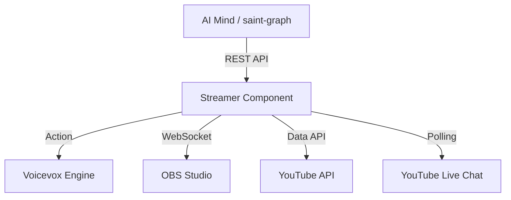

# Streamer Component (Streamer モード)

**Streamer** は、AI Tuber システムの「本番配信」を担当するコンポーネントです。音声合成、映像制御、YouTube 連携を統合した REST API サーバーとして動作します。

## 概要

Streamer は、AI の「思考（Mind）」からの指示を受け、以下の「肉体（Body）」の動作を実行します：
- **音声合成**: Voicevox を使用したテキストの読み上げ。
- **表情制御**: OBS Studio のソースを切り替えて表情を変更。
- **配信制御**: YouTube Live の配信開始・停止、および録画。
- **コメント取得**: YouTube Live チャットからのリアルタイムなコメント取得。

## アーキテクチャ

## API リファレンス

### ヘルスチェック
- **`GET /health`**: サーバーの稼働状態を返します。

### 発話・表情
- **`POST /api/speak`**: 音声合成と再生を行います。
    - Body: `{"text": "こんにちは", "style": "neutral", "speaker_id": 1}`
- **`POST /api/change_emotion`**: OBS 上のアバターの表情を変更します。
    - Body: `{"emotion": "happy"}`
    - 選択可能な感情: `neutral`, `happy`, `sad`, `angry`, `joyful`, `fun`, `sorrow`
- **`POST /api/play_audio_file`**: 生成済みの WAV ファイルを再生します（内部使用）。

### コメント取得
- **`GET /api/comments`**: 内部キューに溜まっている新規コメントを取得します。

### 配信制御
- **`POST /api/broadcast/start`**: `STREAMING_MODE` に基づき、配信または録画を開始します。
- **`POST /api/broadcast/stop`**: 配信または録画を停止します。

### 直接操作
- **`POST /api/recording/start`**: OBS の録画を直接開始します。
- **`POST /api/recording/stop`**: OBS の録画を直接停止します。

## 環境変数

| 変数名 | 説明 | デフォルト値 |
|----------|-------------|---------|
| `PORT` | サーバーの待機ポート | `8000` |
| `VOICEVOX_HOST` | Voicevox エンジンのホスト名 | `voicevox` |
| `VOICEVOX_PORT` | Voicevox エンジンのポート | `50021` |
| `OBS_HOST` | OBS Studio のホスト名 | `obs-studio` |
| `OBS_PORT` | OBS WebSocket のポート | `4455` |
| `OBS_PASSWORD` | OBS WebSocket のパスワード | (なし) |
| `YOUTUBE_API_KEY` | YouTube Data API v3 キー | (なし) |
| `YOUTUBE_LIVE_CHAT_ID` | コメント取得用のライブチャット ID | (なし) |
| `YOUTUBE_POLLING_INTERVAL`| コメント取得の間隔（秒） | `5` |
| `STREAMING_MODE` | `true` の場合、YouTube Live 連携を有効化 | `false` |

## セットアップ

Streamer は通常 Docker コンテナ内で動作します。

### 共有ボリューム
`/app/shared/voice` が OBS との間で共有されている必要があります。Streamer が生成した WAV ファイルを OBS がこのパス経由で読み込みます。
