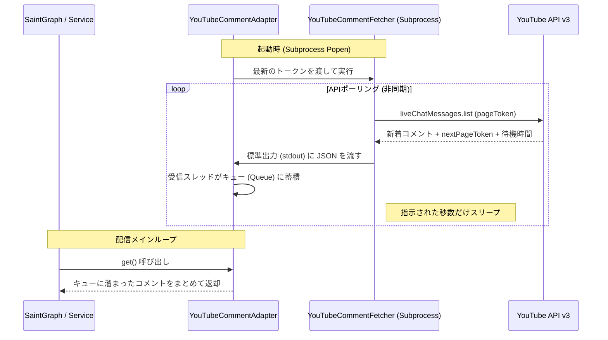

# YouTube コメント取得モジュール

YouTube のライブチャットからリアルタイムにコメントを取得するためのモジュール群です。効率的なポーリングとメインプロセスの保護のために分離された設計になっています。

## 構成モジュール

### 1. `youtube_auth.py` (共通認証)
YouTube Data API v3 を利用するための認証基盤です。
- **役割**: 環境変数やファイルから認証情報を読み込み、API クライアント（Service）を生成します。
- **機能**: トークンの自動リフレッシュや OAuth フローの管理を一括して行い、他のモジュールが認証の詳細を気にせずに済むように抽象化します。

### 2. `youtube_comment_fetcher.py` (サブプロセス)
YouTube API を叩き続ける「作業員」です。
- **特徴**: `YouTubeAuth` を使用して API を呼び出し、新しいコメントを見つけたら標準出力に JSON 形式で出力します。
- **API 最適化**: YouTube が推奨するポーリング間隔 (`pollingIntervalMillis`) を動的に取得し、API 制限にかからないよう自動調節します。

### 3. `youtube_comment_adapter.py` (アダプタークラス)
上記サブプロセスを管理する「マネージャー」です。
- **管理**: `StreamerBodyService` から利用され、裏側で `youtube_comment_fetcher.py` を起動・監視します。
- **非同期処理**: 標準出力から流れてくるコメントを別スレッドで読み取り、キューに溜め込みます。
- **インターフェース**: `get()` メソッドが呼ばれると、それまでに溜まったコメントを安全に返却します。
- **整合性**: `StreamerBodyService` 内でインスタンスとして保持され、配信中に一貫して同じサブプロセスと通信します。

## 設定 (環境変数)
| 変数名 | 説明 |
| :--- | :--- |
| `YOUTUBE_TOKEN_JSON` | `youtube_comment_fetcher.py` が使用する OAuth 認証情報 (JSON 文字列) |
| `YOUTUBE_POLLING_INTERVAL` | デフォルトの取得間隔（秒） |

## データの流れ

YouTube コメント取得のプロセスは、外部 API との通信（非同期）と、内部システムからの取得要求のタイミングが異なるため、以下のシーケンスで動作します。

1.  **初期化**: アダプターが起動すると、環境変数を引き継いで `youtube_comment_fetcher.py` をサブプロセスとして立ち上げます。
2.  **継続的フェッチ**: フェッチャーは YouTube API をポーリングし続け、新しいコメントを発見するたびに標準出力に出力します。
3.  **バッファリング**: アダプター内の専用スレッドが、フェッチャーから流れてくる JSON をリアルタイムに読み取り、メモリ上のキューに溜め込みます。
4.  **提供**: `SaintGraph` 等の外部モジュールが `get()` を呼ぶと、アダプターは蓄積されたコメントを一括で引き渡します。

## なぜサブプロセスに分けているのか？

AI Tuber の安定配信を実現するため、コメント取得はメインプロセスから分離され、独立したサブプロセスとして実行されます。これには以下の 4 つの重要な理由があります。

### 1. メインループのブロック（停止）防止
メインの Body サービスは、音声再生や OBS 制御をミリ秒単位で管理しています。YouTube API の取得はネットワーク通信や「5秒間待機せよ」といった API 側の指示により実行が一時停止するため、これをメインプロセスで行うと、配信中の声や動きが止まる（カクつく）致命的な問題が発生します。

### 2. Python GIL (Global Interpreter Lock) の回避
Python は一つのプロセス内では同時に一つの CPU 命令しか実行できません（GIL）。コメント取得を別プロセスに分けることで、マルチコア CPU のリソースを個別に活用でき、コメント取得が重くなった場合でもメインの配信制御（特に音声の生成と再生）のパフォーマンスを維持できます。

### 3. サバイバリビリティ（生存性）の向上
外部 API との通信はエラーが起きやすい場所です。万が一、ライブラリのバグや予期せぬ通信エラーで取得処理がクラッシュしても、サブプロセスであればメインシステム（配信自体）を巻き込んで落ちることがありません。アダプターがエラーを検知し、配信を止めることなく取得プロセスだけを再起動することが可能です。

### 4. メモリリークの防止とクリーンな空間の維持
多機能な API クライアントを長時間稼働させると、内部キャッシュ等によりメモリ使用量が微増し続けることがありますが、別プロセスに隔離することで本体のメモリ空間を常にクリーンに保ち、数日間の連続配信でも高い安定性を維持できます。

## 設計思想と命名の理由：インターフェースと実装の分離

本プロジェクトでは、上位モジュール（サービスクラス）から直接呼び出される窓口を「アダプター」と呼び、実際の外部通信を行うスクリプトを「フェッチャー（実装詳細）」と定義しています。

1. **インターフェースとしての `youtube_comment_adapter.py`**
   - サービスクラスに対し「コメントを取得する」という抽象的な機能を提供します。
   - 裏側で「サブプロセスを起動する」という具体的な**手段（実装方針）を選択する責務**を負います。
2. **実装詳細としての `youtube_comment_fetcher.py`**
   - アダプターに選ばれた「実行パーツ」です。
   - YouTube API との物理的なやり取りに特化し、標準入出力という疎結合な手段でアダプターにデータを届けます。

この分離により、将来的に取得ロジックを非同期ライブラリ等に変更する場合でも、サービスクラスは影響を受けず、アダプター内の「手段」を差し替えるだけで済む柔軟性を確保しています。
