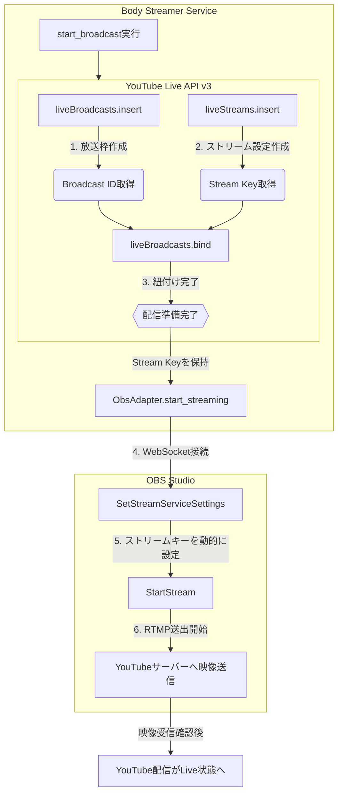

# YouTube Live 管理モジュール (youtube_live_adapter.py)

`youtube_live_adapter.py` は、[YouTube Data API v3](https://developers.google.com/youtube/v3?hl=ja) を使用して配信枠の作成やストリーミングの権限管理を行うモジュールです。

## 主な役割
1. **OAuth 2.0 認証**: Google アカウントでのログインと、アクセストークンの管理・自動更新を行います。
2. **配信枠 (Broadcast) の作成**: 配信のタイトル、説明、予約時間を設定して YouTube 上に配信枠を作成します。
3. **ストリーム設定**: 配信解像度や遅延設定（超低遅延など）を行い、ストリームキーを取得します。

## 設定 (環境変数)
- `YOUTUBE_CLIENT_SECRET_JSON`: Google Cloud Console から取得した OAuth クライアント設定の JSON 文字列。
- `YOUTUBE_TOKEN_JSON`: 認証後に生成されるトークン情報の JSON 文字列。
- `YOUTUBE_CLIENT_SECRET_PATH`: (互換用) クライアント設定ファイルのパス。
- `YOUTUBE_TOKEN_PATH`: (互換用) トークン保存用ファイルのパス。

## 主要な仕組み

### OAuth 認証フロー
認証処理は `youtube_auth.py` に集約されており、以下のフローで実行されます：
1. `SECRET_PROVIDER_TYPE` に基づき、環境変数 (`env`) または GCP Secret Manager (`gcp`) から JSON を取得します。
2. `YouTubeAuth.get_credentials()` が呼ばれ、有効なトークンがあればそれを使用します。
3. 有効なトークンがない場合、自動的に `YouTubeAuth.start_oauth_flow()` が実行され、コンソールに認証用 URL が表示されます。
4. ユーザーがブラウザで許可を与え、表示されたコードをコンソールに入力します。
5. 取得したトークンはメモリ上で管理され、API 呼び出しの際に `YouTubeAuth` によって自動でリフレッシュされます。

### 配信開始プロセス
`create_live()` 関数は以下の手順を自動的に実行します。これにより、YouTube 側での枠作成から OBS での送出開始までをプログラムで完結させています。

1.  **YouTube側（枠の準備）**:
    *   **liveBroadcasts.insert**: 配信のタイトル、説明、非公開設定などのメタデータを持つ「器」を作成します。
    *   **liveStreams.insert**: 配信の「入り口」となるストリーム設定を作成し、同時に **Stream Key (ストリームキー)** を生成します。
    *   **liveBroadcasts.bind**: 作成した「器（放送枠）」と「入り口（ストリーム設定）」を紐付け、映像の受取口を確定させます。
2.  **OBS側（映像の送出）**:
    *   **SetStreamServiceSettings (WebSocket)**: YouTube から取得した最新のストリームキーを、OBS の配信設定へ動的に入力します。
    *   **StartStream (WebSocket)**: 配信開始コマンドを送信します。OBS は設定されたキーを用いて YouTube の RTMP サービスへ映像・音声をプッシュします。

## 注意事項
- YouTube Data API には一日の割り当て制限（クォータ）があります。無駄な配信枠の作成には注意してください。
- 配信の開始には、YouTube 側での電話番号認証済みのチャンネルが必要です。
- 本システムはシークレットをファイルに書き込まずメモリ上で扱うため、Secret Manager 等との連携が推奨されます。
