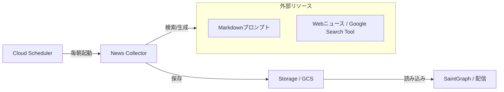
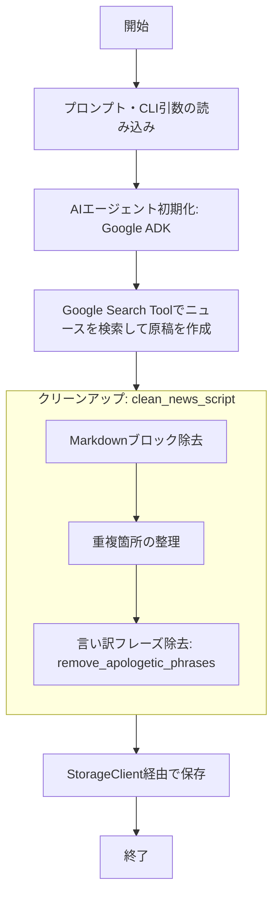

# ニュース収集エージェント (News Collector)

`scripts/news_collector/news_agent.py` は、Google ADK の AI エージェントを使って最新のニュースをウェブから収集し、AI Tuber が読み上げるための原稿（Markdown 形式）を自動生成・保存するスタンドアロンツールです。

Cloud Run Job として毎朝定刻に実行されることを想定した設計になっています。

---

## システム内での位置づけ

`news_agent.py` は、外部リソースを組み合わせてニュースを「料理」し、配信システムへ届ける独立したコンポーネントです。

### 全体アーキテクチャ



### 内部処理フロー

プログラム内部では、以下のステップで原稿を生成しています。



1.  **インプット**: CLI から取得した日付・テーマと、外部ファイル化したプロンプトを合成します。
2.  **AI 処理**: **Google ADK** をベースとしたエージェントが **Google Search Tool** を使い、指定日に合わせた正確な情報を検索した上で要約します。
3.  **ポストプロセス**: 生成された原稿から、AI 特有の「言い訳」や不要な装飾をプログラムレベルで削ぎ落とします。
4.  **永続化**: 配信サーバーがアクセス可能な場所に、抽象化された `StorageClient` を用いて保存します。

---

## 使用方法

プロジェクトのルートディレクトリから実行します。

### 基本的な実行（今日のニュース）
```bash
python -m scripts.news_collector.news_agent
```

### 日付を指定して実行 (YYYY-MM-DD)
```bash
python -m scripts.news_collector.news_agent --date 2024-02-04
```

### テーマを指定して実行
テーマはパイプ (`|`) で区切ります。
```bash
python -m scripts.news_collector.news_agent --themes "全国の天気|最新のAIニュース"
```

### Docker コンテナとして実行
```bash
docker build -t news-collector -f scripts/news_collector/Dockerfile .
docker run --env-file .env news-collector
```

---

## 設定 (環境変数)

| 変数名 | 必須 | 説明 |
| :--- | :---: | :--- |
| `GOOGLE_API_KEY` | ✅ | Gemini および Google Search API のキー |
| `STORAGE_TYPE` | | `gcs` を指定すると GCS にアップロード。未指定時はローカルのみ |
| `GCS_BUCKET_NAME` | | `STORAGE_TYPE=gcs` 時の保存先バケット名 |
| `MODEL_NAME` | | Gemini モデル名（デフォルト: `gemini-2.5-flash-lite`） |

---

## デフォルトテーマ一覧

| テーマ | 制約 |
| :--- | :--- |
| 気になるアニメや VTuber の話題 | ジャンプ系除外、1〜3 項目に絞る |
| 全国の天気予報 | |
| 本日の経済指標 (S&P500, 日経平均, 為替ドル円, BTC, 金) | |
| 経済関連ニュース | |
| 国内の政治経済ニュース | 3〜5 項目と少し厚めに |
| 最新テックニュース | |

---

## 実装の詳細

### AI エージェント構成

[Google ADK (Agent Development Kit)](https://google.github.io/adk-docs/) を使って、`NewsEditor` という AI エージェントを構築しています。

- **モデル**: `Gemini` (設定された `MODEL_NAME` を使用)
- **ツール**: `GoogleSearchTool` (Grounding 付き Google 検索)
- **セッション**: `InMemoryRunner` による軽量なインメモリセッション管理

### プロンプト管理

プロンプトはコードから分離され、以下のファイルで管理されています。これにより、ロジックを変更せずにエージェントの挙動やトーンを調整することが可能です。

- **`system_prompt.md`**: エージェントの役割、出力形式、禁止事項などのシステム指示。
- **`user_prompt.md`**: テーマや日付を注入するためのユーザープロンプトテンプレート。

### クリーンアップロジック (`clean_news_script`)

AI が生成したテキストは、そのままでは使いにくい場合があるため、以下のポストプロセスを実施します：

1. **Markdown コードブロックの除去**: ` ```markdown ` 等を除去し、純粋なテキストのみを抽出します。
2. **重複防止**: `# News Script` が複数含まれている場合、最初の 1 つのみを採用します。
3. **言い訳フレーズの除去**: 以下のようなフレーズを含む行を正規表現で検出・削除します。
   - 「〜は見つかりませんでした」
   - 「〜に関するデータはありません」
   - 「具体的な〜は見つかりませんでしたが、...」 ← 接続詞以降の有効部分は残す

### ストレージ保存フロー

`StorageClient` を通じた引数一つの抽象的な保存を行います。

```python
logical_key = "news/news_script.md"

# ローカル保存 (常時)
with open(local_output_path, "w") as f:
    f.write(cleaned_response)

# GCS アップロード (STORAGE_TYPE=gcs 時のみ)
if os.getenv("STORAGE_TYPE") == "gcs":
    storage.upload_file(key=logical_key, src=local_output_path)
```

---

## クラウドデプロイ (Cloud Run Job)

### アーキテクチャ

```
Cloud Scheduler (07:00 JST)
    └── Cloud Run Job (news-collector)
            └── GCS (news/news_script.md)
                    └── SaintGraph (配信時)
```

### デプロイ手順

```bash
# Docker イメージをビルドして Artifact Registry にプッシュ
docker build \
  -t asia-northeast1-docker.pkg.dev/PROJECT_ID/ai-tuber/news-collector:latest \
  -f scripts/news_collector/Dockerfile .
docker push asia-northeast1-docker.pkg.dev/PROJECT_ID/ai-tuber/news-collector:latest

# OpenTofu でリソースを適用
cd opentofu && tofu apply
```

### CI/CD (Cloud Build)

`scripts/news_collector/` または `src/infra/` の変更が `main` ブランチにプッシュされると、Cloud Build が自動的にイメージをビルド・デプロイします (`cloudbuild-news-collector.yaml`)。

---

## 開発・デバッグ

### ユニットテストの実行

`clean_news_script` 関数の動作を検証するユニットテストが用意されています。

```bash
pytest tests/test_news_collector.py -v
```

テストでカバーされている項目：
- Markdown コードブロックの除去
- 重複出力の防止
- 言い訳フレーズの除去
- 接続詞（「が、」など）を伴う言い訳の部分的な保持

---

## 関連ドキュメント

- [ニュース配信サービス (news-delivery.md)](../saint-graph/news-delivery.md) - 収集した原稿を読み上げる `NewsService` の詳細
- [コアロジック](../saint-graph/core-logic.md) - Saint Graph のターン処理
- [Saint Graph README](../saint-graph/README.md) - Saint Graph 概要
