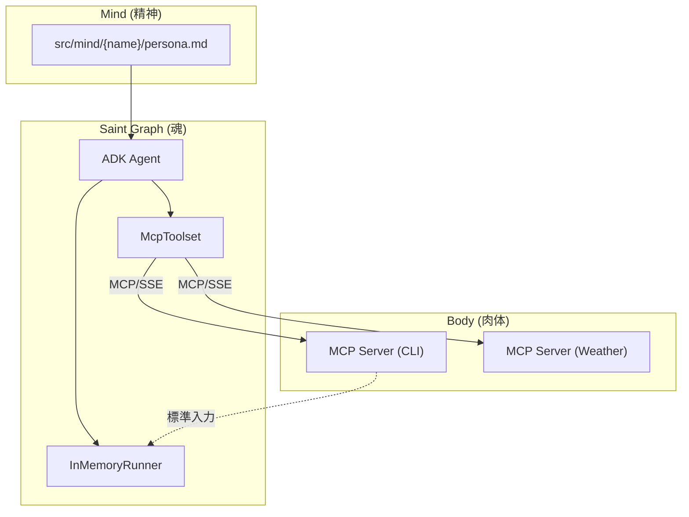
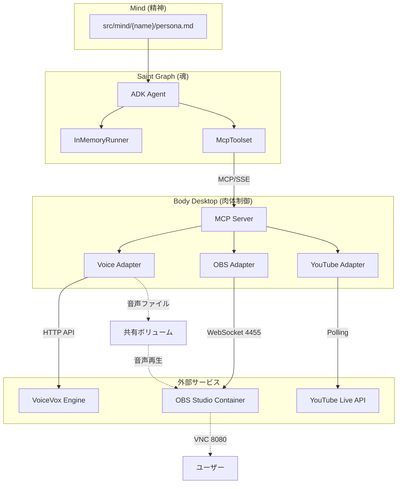

# AITuber システム統合移行計画書

**プロジェクト:** AI Tuber (Ren Koduki) - Docker完結型 OBS配信基盤への移行  
**移行元ブランチ:** main (current)  
**アーキテクチャ:** Saint Graph / MCP Architecture  
**作成日:** 2026-01-15

---

## 📊 現状分析

### 既存システム構成

現在のシステムは以下の3つのDockerサービスで構成されています:

| サービス名 | 役割 | 技術スタック | ステータス |
|---|---|---|---|
| **saint-graph** | [魂] AI思考・対話エンジン | Python / ADK / Gemini | ✅ 稼働中 |
| **body-cli** | [肉体] CLI入出力 | Python / FastMCP | ✅ 稼働中 |
| **body-weather** | [肉体] 天気情報取得 | Python / FastMCP | ✅ 稼働中 |

### 現在のアーキテクチャ図



### 移行が必要な理由

1. **配信機能の欠如**: 現在のシステムには映像配信（OBS）、音声合成（VoiceVox）の機能が存在しない
2. **CLI限定**: CLIベースの入出力のみで、YouTube Live配信やコメント取得機能がない
3. **視覚表現の不在**: アバターの表情変更やライブ配信のための映像合成機能がない

---

## 🎯 移行後のシステム構成

### ターゲットアーキテクチャ (4サービス構成)

| サービス名 | 役割 | 構成技術 | 責任範囲 |
|---|---|---|---|
| **saint-graph** | [脳] 思考・対話 | Python / ADK / Gemini | 会話内容の生成、感情決定、ツール呼び出し指示 |
| **body-desktop** | [肉体] 制御ハブ | Python / FastMCP | **【新規】** 脳からの指示(MCP)を受け、各デバイス(OBS/VoiceVox)を操作 |
| **obs-studio** | [顔] 配信・映像 | Ubuntu / OBS / Fluxbox | **【新規】** 映像合成、配信エンコード。VNC経由でGUI確認可能 |
| **voicevox** | [声] 音声合成 | VoiceVox Engine | **【新規】** 音声データの生成APIを提供 |

### 移行後のアーキテクチャ図



### 通信フロー

1. **思考→発話**: `saint-graph` → MCP → `body-desktop` → VoiceVox API → 共有ボリューム → OBS
2. **表情変更**: `saint-graph` → MCP → `body-desktop` → OBS WebSocket (立ち絵ソース切り替え)
3. **コメント取得**: YouTube Live API ← (Polling) `body-desktop` → MCP → `saint-graph`
4. **配信監視**: ブラウザ → VNC (port 8080) → OBS GUI

---

## 📋 実装フェーズ計画

### Phase 1: インフラ構築 (OBS / VoiceVox)

配信スタジオとしての基盤を構築します。

#### タスク 1.1: VoiceVox サービスの追加

**目的**: 音声合成APIサーバーを Docker Compose に追加

**作業内容**:
- `docker-compose.yml` に `voicevox` サービスを定義
- Docker Hub の公式 VoiceVox Engine イメージを使用
- ポート `50021` を公開
- ヘルスチェックエンドポイント (`/version`) を設定

**変更ファイル**:
- [MODIFY] [docker-compose.yml](file:///app/docker-compose.yml)

```yaml
voicevox:
  image: voicevox/voicevox_engine:cpu-ubuntu20.04-latest
  ports:
    - "50021:50021"
  healthcheck:
    test: ["CMD", "curl", "-f", "http://localhost:50021/version"]
    interval: 10s
    timeout: 5s
    retries: 5
```

---

#### タスク 1.2: OBS Studio コンテナの作成

**目的**: GUI経由で配信設定・監視可能なOBSコンテナを構築

**作業内容**:
- `docker/obs/` ディレクトリを新規作成
- Ubuntu 22.04 ベースの Dockerfile を作成
- 必須パッケージのインストール:
  - `obs-studio`: 配信ソフトウェア本体
  - `xvfb`: 仮想ディスプレイサーバー
  - `fluxbox`: 軽量ウィンドウマネージャー
  - `x11vnc`: VNCサーバー
  - `novnc`: WebベースVNCクライアント
  - `supervisor`: プロセス管理
  - `pulseaudio`: 音声サブシステム
- `supervisord.conf` で起動順序を制御 (Xvfb → Fluxbox → VNC → noVNC → OBS)
- OBS WebSocket プラグインを有効化 (port 4455)
- Fluxbox の `apps` ファイルでOBSを全画面起動

**新規ファイル**:
- [NEW] `docker/obs/Dockerfile`
- [NEW] `docker/obs/supervisord.conf`
- [NEW] `docker/obs/apps` (Fluxbox設定)

**参考構成**:
```dockerfile
FROM ubuntu:22.04
ENV DEBIAN_FRONTEND=noninteractive
RUN apt-get update && apt-get install -y \
    obs-studio x11vnc xvfb fluxbox novnc \
    supervisor pulseaudio curl
```

---

#### タスク 1.3: Docker Compose への OBS サービス追加

**目的**: OBSコンテナをシステムに統合

**作業内容**:
- `docker-compose.yml` に `obs-studio` サービスを追加
- 共有ボリューム `audio_share` を作成 (音声ファイル受け渡し用)
- ポート公開:
  - `8080`: noVNC (ブラウザからOBS GUI アクセス)
  - `4455`: OBS WebSocket (プログラムからの制御用)
- `body-desktop` と `obs-studio` の両方に `/tmp/audio` として共有ボリュームをマウント

**変更ファイル**:
- [MODIFY] [docker-compose.yml](file:///app/docker-compose.yml)

**追加構成例**:
```yaml
volumes:
  audio_share:

services:
  obs-studio:
    build:
      context: .
      dockerfile: docker/obs/Dockerfile
    ports:
      - "8080:8080"  # noVNC
      - "4455:4455"  # OBS WebSocket
    volumes:
      - audio_share:/tmp/audio
      - ./data/obs_assets:/app/assets:ro
    environment:
      - DISPLAY=:99
```

---

### Phase 2: Body Desktop の実装

旧リポジトリの `src/frontend` ロジックを、MCPサーバーとして新規実装します。

> [!IMPORTANT]
> **レガシーコードの移植について**  
> 本計画書では「旧リポジトリ」の参照を前提としていますが、現在のメインブランチには該当コードが存在しません。  
> 実装時には、以下のいずれかの方法で進めます:
> 1. 旧リポジトリのコードを参照可能な場合: 該当アダプターを参考に実装
> 2. 参照不可の場合: 本計画書の仕様に基づいてゼロから実装

---

#### タスク 2.1: プロジェクト構造の作成

**目的**: `body-desktop` サービスのプロジェクトスケルトンを作成

**作業内容**:
- `src/body/desktop/` ディレクトリを作成
- 必要な依存関係を `requirements.txt` に定義
- Dockerfile を作成

**新規ファイル**:
- [NEW] `src/body/desktop/requirements.txt`
- [NEW] `src/body/desktop/Dockerfile`
- [NEW] `src/body/desktop/__init__.py`
- [NEW] `src/body/desktop/main.py` (エントリーポイント)

**依存パッケージ** (`requirements.txt`):
```
fastapi
uvicorn
mcp
requests
obs-websocket-py
google-api-python-client
google-auth-oauthlib
google-auth-httplib2
```

**Dockerfile 構成例**:
```dockerfile
FROM python:3.11-slim
WORKDIR /app
COPY src/body/desktop/requirements.txt .
RUN pip install --no-cache-dir -r requirements.txt
COPY src/ /app/src/
CMD ["python", "-m", "src.body.desktop.main"]
```

---

#### タスク 2.2: アダプターの実装

**目的**: 各外部サービスとの通信を担当するアダプタークラスを実装

##### 2.2.1: Voice Adapter (`voice.py`)

**機能**:
- VoiceVox Engine との通信
- 音声合成リクエスト
- WAVファイルの共有ボリュームへの保存
- OBS WebSocket経由でメディアソースのリフレッシュ

**新規ファイル**:
- [NEW] `src/body/desktop/voice.py`

**主要メソッド**:
```python
async def generate_speech(text: str, speaker_id: int = 1) -> str:
    """VoiceVox APIを叩いて音声合成"""
    
async def save_to_shared_volume(audio_data: bytes, filename: str) -> str:
    """共有ボリュームに音声ファイルを保存"""
    
async def generate_and_play(text: str, style: str = "normal") -> str:
    """音声生成→保存→OBS通知の統合フロー"""
```

**環境変数**:
- `VOICEVOX_HOST`: VoiceVox Engine のホスト名 (デフォルト: `voicevox`)
- `VOICEVOX_PORT`: VoiceVox Engine のポート (デフォルト: `50021`)

---

##### 2.2.2: OBS Adapter (`obs.py`)

**機能**:
- OBS WebSocket (obs-websocket v5) を使用した制御
- シーンアイテムの表示/非表示切り替え (表情管理)
- メディアソースの更新 (音声ファイル再生)

**新規ファイル**:
- [NEW] `src/body/desktop/obs.py`

**主要メソッド**:
```python
async def connect() -> bool:
    """OBS WebSocketへの接続"""
    
async def set_visible_source(emotion: str) -> str:
    """指定された感情に対応する立ち絵ソースを表示"""
    
async def refresh_media_source(source_name: str, file_path: str) -> str:
    """メディアソースのファイルパスを更新して再生"""
```

**環境変数**:
- `OBS_HOST`: OBS WebSocket のホスト名 (デフォルト: `obs-studio`)
- `OBS_PORT`: OBS WebSocket のポート (デフォルト: `4455`)
- `OBS_PASSWORD`: WebSocket パスワード (オプション)

**感情→立ち絵ソースのマッピング (想定)**:
```python
EMOTION_MAP = {
    "neutral": "avatar_neutral",
    "happy": "avatar_happy",
    "sad": "avatar_sad",
    "angry": "avatar_angry",
}
```

---

##### 2.2.3: YouTube Adapter (`youtube.py`)

**機能**:
- YouTube Live API を使用したコメント取得
- バックグラウンドスレッドでのポーリング
- 新規コメントのキューイング

**新規ファイル**:
- [NEW] `src/body/desktop/youtube.py`

**主要メソッド**:
```python
def start_comment_polling(live_chat_id: str, interval: int = 5):
    """バックグラウンドスレッドでコメントポーリングを開始"""
    
async def get_new_comments() -> str:
    """キューから新規コメントを取得 (JSON形式で返却)"""
```

**環境変数**:
- `YOUTUBE_API_KEY`: YouTube Data API v3 のAPIキー
- `YOUTUBE_LIVE_CHAT_ID`: 配信のライブチャットID

> [!NOTE]
> **実装上の注意**  
> YouTube Live API は無限ループでポーリングしますが、`threading.Thread(daemon=True)` として実装し、メインのMCPサーバーをブロックしないようにします。

---

#### タスク 2.3: MCP ツールの定義 (`tools.py`)

**目的**: 上記アダプターをMCPツールとしてラップし、`saint-graph` から呼び出せるようにする

**新規ファイル**:
- [NEW] `src/body/desktop/tools.py`

**実装する MCP ツール**:

| ツール名 | 引数 | 戻り値 | 内部処理 |
|---|---|---|---|
| `speak` | `text: str, style: str = "normal"` | `"発話完了"` | `voice.generate_and_play()` |
| `change_emotion` | `emotion: str` | `"表情変更: {emotion}"` | `obs.set_visible_source()` |
| `sys_get_comments` | なし | `"[{author, message}]"` (JSON) | `youtube.get_new_comments()` |

**参考実装** (既存の `body-cli` に準拠):
```python
async def speak(text: str, style: str = "normal") -> str:
    """視聴者に対してテキストを発話します。"""
    return await voice.generate_and_play(text, style)

async def change_emotion(emotion: str) -> str:
    """アバターの表情（感情）を変更します。"""
    return await obs.set_visible_source(emotion)

async def get_comments() -> str:
    """ユーザーからのコメントを取得します。"""
    return await youtube.get_new_comments()
```

---

#### タスク 2.4: MCP サーバーのエントリーポイント (`main.py`)

**目的**: FastMCP サーバーとして起動し、ツールを公開

**変更ファイル**:
- [MODIFY] `src/body/desktop/main.py`

**実装内容**:
- 既存の `src/body/cli/main.py` を参考にする
- FastMCP サーバーの初期化
- ツール登録 (`@mcp.tool` デコレーター)
- ヘルスチェックエンドポイント (`/health`)
- YouTube コメントポーリングのスレッド起動

**構成例**:
```python
from mcp.server.fastmcp import FastMCP
from .tools import speak, change_emotion, get_comments
from .youtube import start_comment_polling

mcp = FastMCP("body-desktop")

@mcp.tool(name="speak")
async def speak_tool(text: str, style: str = "normal") -> str:
    return await speak(text, style)

# ... 他のツール登録

if __name__ == "__main__":
    start_comment_polling(...)  # 環境変数から設定を読み込み
    uvicorn.run(mcp.sse_app(), host="0.0.0.0", port=8000)
```

---

#### タスク 2.5: Docker Compose への統合

**目的**: `body-desktop` サービスを Docker Compose に追加

**変更ファイル**:
- [MODIFY] [docker-compose.yml](file:///app/docker-compose.yml)

**追加内容**:
```yaml
body-desktop:
  build:
    context: .
    dockerfile: src/body/desktop/Dockerfile
  ports:
    - "8002:8000"
  volumes:
    - audio_share:/tmp/audio
  environment:
    - PORT=8000
    - VOICEVOX_HOST=voicevox
    - OBS_HOST=obs-studio
    - OBS_PORT=4455
    - YOUTUBE_API_KEY=${YOUTUBE_API_KEY}
    - YOUTUBE_LIVE_CHAT_ID=${YOUTUBE_LIVE_CHAT_ID}
  depends_on:
    voicevox:
      condition: service_healthy
    obs-studio:
      condition: service_started
  healthcheck:
    test: ["CMD", "curl", "-f", "http://localhost:8000/health"]
    interval: 5s
    timeout: 2s
    retries: 5
```

---

### Phase 3: Saint Graph の接続切り替え

#### タスク 3.1: MCP 接続先の変更

**目的**: `saint-graph` が `body-cli` ではなく `body-desktop` に接続するように変更

**変更ファイル**:
- [MODIFY] [docker-compose.yml](file:///app/docker-compose.yml)

**変更内容**:
```diff
saint-graph:
  environment:
-   - MCP_URL=http://body-cli:8000/sse
+   - MCP_URL=http://body-desktop:8000/sse
  depends_on:
-   body-cli:
+   body-desktop:
      condition: service_healthy
```

> [!WARNING]
> **Breaking Change**  
> この変更により、`body-cli` は使用されなくなります。既存のCLIベースのテストや開発フローに影響がある可能性があります。

---

#### タスク 3.2: 環境変数の追加

**目的**: YouTube API 関連の環境変数を `.env.example` に追加

**変更ファイル**:
- [MODIFY] `.env.example`

**追加内容**:
```bash
# YouTube Live API
YOUTUBE_API_KEY=your_youtube_api_key_here
YOUTUBE_LIVE_CHAT_ID=your_live_chat_id_here
```

---

### Phase 4: アセットの準備

#### タスク 4.1: OBS アセットディレクトリの作成

**目的**: 立ち絵画像やその他のメディアアセットを配置

**作業内容**:
- `data/obs_assets/` ディレクトリを作成
- 各感情に対応する画像ファイルを配置 (例: `avatar_happy.png`, `avatar_sad.png`)

**新規ディレクトリ**:
- [NEW] `data/obs_assets/`

**想定ファイル構成**:
```
data/obs_assets/
├── avatar_neutral.png
├── avatar_happy.png
├── avatar_sad.png
├── avatar_angry.png
└── background.png
```

---

### Phase 5: ドキュメント更新

#### タスク 5.1: README の更新

**目的**: 新しいシステム構成と起動方法を反映

**変更ファイル**:
- [MODIFY] [README.md](file:///app/README.md)

**追加セクション**:
- OBS Studio への VNC アクセス方法 (`http://localhost:8080`)
- YouTube Live Chat ID の取得方法
- 配信開始までのセットアップ手順

---

#### タスク 5.2: アーキテクチャドキュメントの更新

**目的**: 新しい4サービス構成を反映

**変更ファイル**:
- [MODIFY] [docs/ARCHITECTURE.md](file:///app/docs/ARCHITECTURE.md)

**更新内容**:
- システムマップを4サービス構成に更新
- 通信フローの図解を追加
- `body-desktop` の役割を記載

---

## ✅ 検証計画

### 自動テスト

#### ユニットテスト

**新規テストファイル**:
- `tests/unit/test_voice_adapter.py`: VoiceVox API のモック通信テスト
- `tests/unit/test_obs_adapter.py`: OBS WebSocket のモック通信テスト
- `tests/unit/test_youtube_adapter.py`: YouTube API のモック通信テスト

**実行コマンド**:
```bash
pytest tests/unit/ -v
```

---

#### インテグレーションテスト

**新規テストファイル**:
- `tests/integration/test_body_desktop.py`: `body-desktop` の各MCPツールのエンドポイントテスト

**実行コマンド**:
```bash
pytest tests/integration/ -v
```

---

#### E2E テスト

**新規テストファイル**:
- `tests/e2e/test_streaming_flow.py`: 全サービス起動 → 音声合成 → OBS制御 → 正常終了の疎通確認

**実行コマンド**:
```bash
pytest tests/e2e/ -v -s
```

---

### 手動検証

#### 検証 1: OBS コンテナの GUI アクセス

**手順**:
1. `docker compose up --build` でシステムを起動
2. ブラウザで `http://localhost:8080` にアクセス
3. OBS Studio の GUI が表示されることを確認

**期待結果**: noVNC 経由で OBS の画面が表示され、ソース一覧が確認できる

---

#### 検証 2: VoiceVox 音声合成

**手順**:
1. `body-desktop` コンテナにアタッチ
2. 以下の curl コマンドで音声合成をテスト:
```bash
curl -X POST "http://voicevox:50021/audio_query?text=こんにちは&speaker=1" \
  -H "Content-Type: application/json"
```
3. レスポンスが返ることを確認

**期待結果**: JSON形式のクエリデータが返却される

---

#### 検証 3: Saint Graph → Body Desktop 統合フロー

**手順**:
1. `docker compose up --build` でシステムを起動
2. `saint-graph` のログを監視:
```bash
docker compose logs -f saint-graph
```
3. `body-desktop` に対して `speak` ツールが呼び出されることを確認
4. `/tmp/audio` に WAV ファイルが生成されることを確認

**期待結果**:
- `saint-graph` が `body-desktop` の MCP ツールを正常に呼び出す
- 音声ファイルが共有ボリュームに保存される
- OBS が音声を再生 (GUI で確認可能)

---

#### 検証 4: YouTube コメント取得 (要手動設定)

> [!CAUTION]
> この検証には、実際の YouTube Live 配信と API キーが必要です。

**手順**:
1. YouTube Studio で配信を開始し、Live Chat ID を取得
2. `.env` に `YOUTUBE_LIVE_CHAT_ID` を設定
3. `docker compose restart body-desktop` で再起動
4. コメント投稿後、`saint-graph` のログでコメントが取得されることを確認

**期待結果**: 投稿したコメントが5秒以内に `saint-graph` に届く

---

## 📁 最終ディレクトリ構成

```
.
├── docker-compose.yml                 [MODIFY] 全4サービス定義
├── .env.example                       [MODIFY] YouTube API設定を追加
├── README.md                          [MODIFY] 新システム起動方法を記載
├── docker/
│   └── obs/                           [NEW] OBSコンテナ関連
│       ├── Dockerfile
│       ├── supervisord.conf
│       └── apps
├── src/
│   ├── saint_graph/                   [既存] 脳 (環境変数のみ変更)
│   ├── mind/                          [既存] 精神 (変更なし)
│   └── body/
│       ├── cli/                       [既存] テスト用Body (非推奨化)
│       ├── weather/                   [既存] 天気Body (継続使用)
│       └── desktop/                   [NEW] 本番用Body
│           ├── Dockerfile
│           ├── requirements.txt
│           ├── __init__.py
│           ├── main.py
│           ├── tools.py
│           ├── voice.py
│           ├── obs.py
│           └── youtube.py
├── data/
│   ├── news/                          [既存]
│   └── obs_assets/                    [NEW] 立ち絵・背景画像
├── docs/
│   ├── ARCHITECTURE.md                [MODIFY] 4サービス構成を反映
│   └── specs/                         [既存]
└── tests/
    ├── unit/
    │   ├── test_voice_adapter.py      [NEW]
    │   ├── test_obs_adapter.py        [NEW]
    │   └── test_youtube_adapter.py    [NEW]
    ├── integration/
    │   └── test_body_desktop.py       [NEW]
    └── e2e/
        └── test_streaming_flow.py     [NEW]
```

---

## 🚀 実装ステップの推奨順序

1. **Phase 1 (インフラ)**: OBS / VoiceVox の Docker 統合を完成させる
2. **Phase 2 (Body Desktop)**: アダプター実装 → MCP ツール定義 → 統合
3. **Phase 3 (接続切替)**: Saint Graph の接続先を変更
4. **Phase 4 (アセット)**: 立ち絵画像を配置
5. **Phase 5 (検証)**: 自動テスト → 手動検証 → ドキュメント更新

---

## 🔧 開発・実行コマンド

```bash
# 1. システムのビルドと起動
docker compose up --build

# 2. OBS 画面の確認 (ブラウザ)
# http://localhost:8080 にアクセス

# 3. ログ確認 (デバッグ)
docker compose logs -f body-desktop
docker compose logs -f saint-graph

# 4. 特定サービスの再起動
docker compose restart body-desktop

# 5. テスト実行
pytest tests/unit/ -v
pytest tests/integration/ -v
pytest tests/e2e/ -v -s
```

---

## 📝 備考・注意事項

### レガシーコードの扱い

本計画書では「旧リポジトリ (`ai-tuber-legacy`)」からの移植を前提としていますが、現在のメインブランチには該当コードが存在しません。  
実装時には、以下のいずれかのアプローチを取ります:

1. **レガシーリポジトリが利用可能な場合**: 該当ファイル (`voicevox_adapter.py` 等) を参考に実装
2. **利用不可の場合**: 本計画書の仕様に基づいて新規実装

### Breaking Changes

- `body-cli` から `body-desktop` への切り替えにより、既存の CLI ベースの開発フローが影響を受けます
- `.env` に YouTube API 関連の設定が必須となります

### セキュリティ考慮事項

- OBS WebSocket のパスワード設定を推奨 (`OBS_PASSWORD` 環境変数)
- YouTube API キーは `.env` ファイルで管理し、`.gitignore` に追加済みであることを確認

---

**次のステップ**: Phase 1.1 (VoiceVox サービスの追加) から実装を開始してください。
